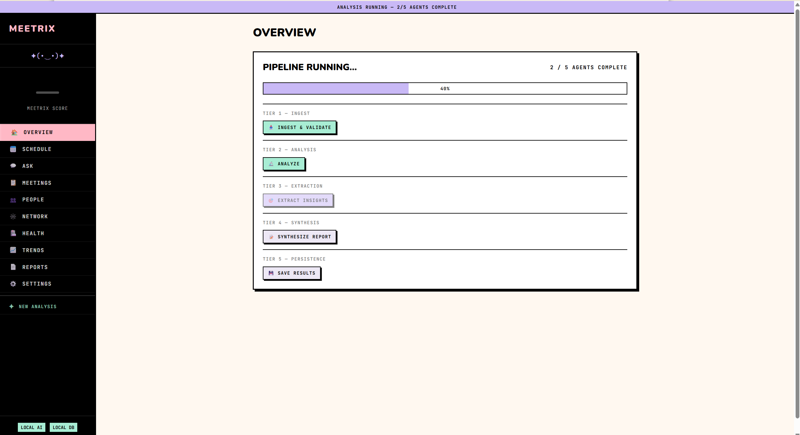
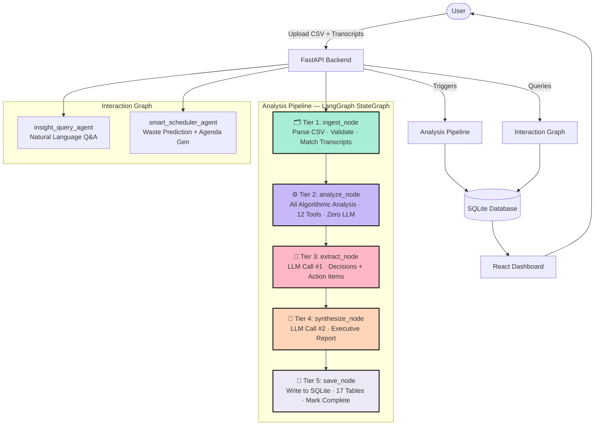
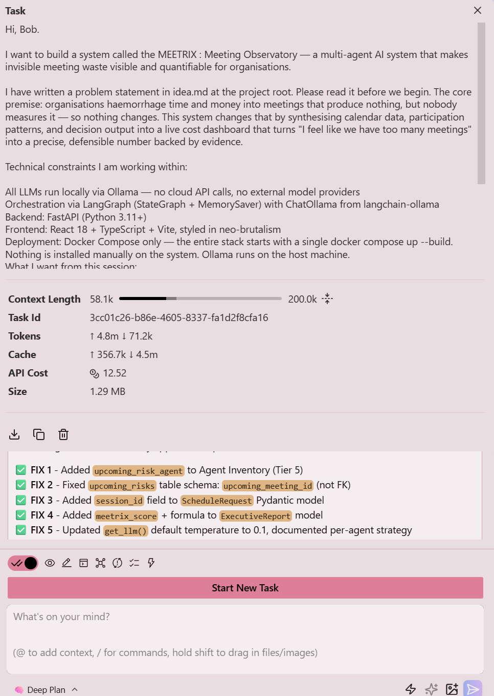
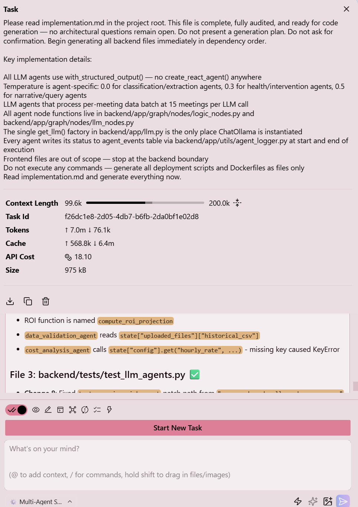
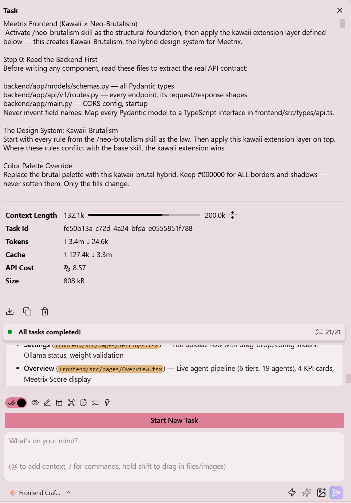

# Meetrix — Meeting Intelligence

> **Reclaim your team's time. Understand. Optimise. Execute.**

Meetrix transforms your chaotic meeting calendar into clear, actionable intelligence. It quantifies exactly how much time and money meetings are costing your team, identifies wasteful patterns, detects costly meeting cascades, and delivers powerful insights — **all running 100% locally** with zero data leaving your machine.


---

## The Problem

Organisations lose an enormous amount of productive time to meetings. Most of this loss is invisible — it never appears on a balance sheet, nobody tracks it, and the people causing it have no idea they are doing so.

The data to diagnose this exists. It lives in calendars, in meeting acceptance patterns, in the ratio of participants to decisions made, in the gap between who is invited and who actually contributes. Nobody synthesises this data because doing so manually would take longer than the meetings themselves.

Knowledge workers spend **15+ hours per week** in meetings, yet most teams lack visibility into which meetings create real value versus which ones multiply waste, delay decisions, and destroy focus time. Meetrix turns raw calendar data into strategic intelligence.

---

## Key Features

### Core Intelligence
- **Meetrix Score** — Overall team meeting health (0–100)
- **Waste Score** per meeting using four weighted dimensions:
  - Cost Factor (25%) — salary cost relative to team budget
  - Decision Deficit (40%) — were real decisions documented?
  - Participation Imbalance (20%) — too many people with too little contribution?
  - Recurrence Staleness (15%) — has this meeting outlived its purpose?
- **Cascade Chain Detection** — Automatically identifies meetings that spawn expensive follow-up chains
- **Meeting Health Score** — Evaluates agenda quality, duration fit, and attendee appropriateness

### People & Network Insights
- Identifies overloaded team members and fragmented focus time
- Interactive **Meeting Network Graph** showing collaboration patterns
- Most central people and highest-cost collaboration pairs

### Ask Meetrix
Natural language AI assistant over your own meeting data:
- "Which meetings cost the most?"
- "What did Sarah say in the last meeting?"
- "Summarise decisions from the Q3 Planning Workshop"

### Actionable Outputs
- Prioritised recommendations (Shorten, Restructure, Cancel)
- Projected annual ROI and savings
- Professional executive reports (export as Markdown or Plain Text)
- Trends, waste distribution, and focus time analysis

### Privacy-First
- Runs entirely locally via **Ollama**
- All data stored in local SQLite
- No cloud services · No external APIs · No telemetry

---

## Screenshots

| Upload Calendar | Attach Transcripts | Overview |
|-----------------|---------------------|----------|
|  |  |  |

| Meetings | Ask Meetrix | People & Focus Time |
|----------|-------------|---------------------|
|  |  |  |

| Network Graph | Health | Trends |
|---------------|--------|--------|
|  |  |  |

| ROI & Recommendations | Executive Report | Executive Report (cont.) |
|-----------------------|-----------------|--------------------------|
|  |  |  |

| Schedule (Coming Soon) |
|------------------------|
|  |

---

## Architecture

### The 5-Tier Analysis Pipeline

Meetrix uses a clean, linear **LangGraph StateGraph** pipeline. Only **2 LLM calls** occur in the entire analysis — the rest is deterministic, auditable algorithmic logic.





### Pipeline Nodes

Only Tiers 3 and 4 invoke an LLM. The other three are pure Python functions.

| Tier | Node | Type | Responsibility |
|------|------|------|----------------|
| 1 | `ingest_node` | Function | Parse CSV, validate fields, match transcript files to meetings by index |
| 2 | `analyze_node` | Function | Classify meetings, compute costs, participation, recurrence, waste scores, health scores, cascade detection, network graph, focus time, recommendations, ROI |
| 3 | `extract_node` | **LLM** | Extract real decisions + action items from transcript/notes text; recompute waste scores with actual decision data |
| 4 | `synthesize_node` | **LLM** | Generate full executive report from compact analysis summary |
| 5 | `save_node` | Function | Write all results to SQLite across 17 tables, mark session complete |

**Interaction Agents** (invoked on demand via the Interaction Graph):

| Agent | Type | Responsibility |
|-------|------|----------------|
| `insight_query_agent` | **LLM** | Answer natural language questions about meeting data using retrieved context |
| `smart_scheduler_agent` | **LLM** | Predict waste probability for proposed meetings, generate agendas |

### Waste Score Formula

```
waste_score = (cost_factor × 0.25)
            + (decision_deficit × 0.40)
            + (participation_imbalance × 0.20)
            + (recurrence_staleness × 0.15)
```

**Decision deficit** is keyword-driven with stacking reductions. Each occurrence of "decided", "approved", "agreed", or "action:" in notes/transcripts reduces the deficit by 0.40, capped at 3 stacked reductions (floor: 0.0).

**Cascade detection** flags a chain when: the origin meeting has `decision_deficit > 0.8`, a follow-up occurs within 72 hours, and attendee overlap exceeds 40% — filtered to skip meetings shorter than 20 minutes or with ≤ 2 attendees.

---

## How It Works

### 1. Upload Your Calendar
Go to **Upload Data** and drop your meeting calendar export (`.csv`) from Google Calendar, Outlook, or any standard calendar app.


### 2. Attach Transcripts (Optional but Recommended)
After uploading the CSV, Meetrix shows all detected meetings. Attach individual `.txt` transcript files to specific meetings. This enables deep extraction of decisions, action items, and discussion quality — significantly improving Decision Deficit scoring and recommendation quality.


### 3. Run Analysis
Configure hourly rate and waste weights, then click **Analyse** to trigger the full 5-tier pipeline.

---

## Transcript Support

Meetrix has first-class support for meeting transcripts:

- Upload `.txt` files for any meeting
- The AI extracts real **decisions**, **action items**, and **outcomes**
- This significantly improves **Decision Deficit** scoring and recommendation quality
- Sample transcripts are included in the `sample_data/` folder

**Example Transcript** (`sample_data/transcript_1.txt`):

```
Meeting: Weekly Status Update
Date: May 5, 2026 | Duration: 60 minutes
Attendees: Diana Ross, Priya Patel, Sarah Chen, Marcus Johnson

Diana: Let's do a quick round-robin.
Sarah: Marketing campaign is on track at 87% of target.
Marcus: Engineering is blocked on API v2 migration. We need a decision on priority.

Action Items:
• Marcus: Resolve API migration blocker
• Sarah: Send campaign metrics
```

---

## Tech Stack

| Layer | Technology |
|-------|-----------|
| Backend | Python 3.11+ · FastAPI · aiosqlite |
| AI Orchestration | LangGraph `StateGraph` · `MemorySaver` checkpointer |
| LLM Provider | Ollama · llama3.2 (local, no cloud) |
| LLM Integration | `ChatOllama` from `langchain-ollama` |
| Frontend | React 18 · TypeScript · Vite · Tailwind CSS |
| Charts | Recharts · D3 (network graph) |
| Design System | Kawaii-Brutalism (thick borders, hard drop shadows, pastel fills) |
| Database | SQLite via Docker volume |
| Deployment | Docker Compose — single command |

---

## Quick Start

### Prerequisites

- [Docker Desktop](https://www.docker.com/products/docker-desktop/) (running)
- [Ollama](https://ollama.ai/) installed and running on host
- llama3.2 model pulled: `ollama pull llama3.2`

### 1. Clone and configure

```bash
git clone <repo-url> meetrix
cd meetrix
cp backend/.env.example backend/.env
```

### 2. Start the stack

```bash
docker compose up --build
```

### 3. Open the dashboard

- **Frontend**: http://localhost:5173
- **Backend API**: http://localhost:8000
- **API Docs**: http://localhost:8000/docs

### 4. Load sample data

Upload `sample_data/sample_meetings.csv` from the Upload screen to see a full analysis immediately. Optionally attach the transcript files from `sample_data/` to individual meetings.

---

## Configuration

Copy `backend/.env.example` to `backend/.env` and adjust as needed:

```env
# Ollama connection
OLLAMA_BASE_URL=http://host.docker.internal:11434

# LLM model per agent (all default to llama3.2)
CLASSIFIER_MODEL=llama3.2
DECISION_EXTRACTION_MODEL=llama3.2
REPORT_GENERATION_MODEL=llama3.2

# Cost calculation (USD per hour)
DEFAULT_HOURLY_RATE=75.0

# Waste detection thresholds
HIGH_WASTE_THRESHOLD=0.50
MEDIUM_WASTE_THRESHOLD=0.30

# Waste dimension weights (must sum to 1.0)
WEIGHT_COST=0.25
WEIGHT_DECISION=0.40
WEIGHT_PARTICIPATION=0.20
WEIGHT_RECURRENCE=0.15
```

---

## Project Structure

```
meetrix/
├── backend/
│   ├── app/
│   │   ├── api/v1/routes.py        # FastAPI endpoints
│   │   ├── config.py               # All settings via pydantic-settings
│   │   ├── graph/
│   │   │   ├── analysis_builder.py # 5-node LangGraph pipeline
│   │   │   ├── interaction_builder.py # Q&A + scheduler graph
│   │   │   ├── nodes/
│   │   │   │   ├── llm_nodes.py    # extract_node + synthesize_node
│   │   │   │   ├── logic_nodes.py  # ingest, analyze, save nodes
│   │   │   │   └── tools.py        # 12 algorithmic tools
│   │   │   └── state.py            # AnalysisState TypedDict
│   │   ├── models/schemas.py       # All Pydantic models
│   │   └── utils/
│   │       ├── agent_logger.py     # agent_events table writer
│   │       └── csv_parser.py       # Calendar CSV normaliser
│   └── Dockerfile
├── frontend/
│   └── src/
│       ├── components/             # All React components
│       ├── lib/api.ts              # Typed API client
│       ├── types/api.ts            # TypeScript ↔ Pydantic mappings
│       └── App.tsx
├── sample_data/                    # Demo CSV + transcripts
├── screenshots/                    # All product screenshots
├── docker-compose.yml
└── README.md
```

---

## IBM BOB Hackathon

> Built at the **IBM BOB Hackathon 2026** using ibm bob with custom Bob modes.

### What We Built

Meetrix was built **end-to-end in a single day** using a structured workflow of custom Bob modes. The entire system — from architectural blueprint to a fully deployed, polished product — was generated through structured AI-assisted development sessions documented in `bob_sessions/`.

### Bob Session Workflow

```
deep-plan mode + /grill-me      →  implementation.md (architectural blueprint)
        ↓
multi-agent-system-builder      →  full FastAPI + LangGraph backend
        ↓
frontend-craftsman + /neo-brutalism  →  React + TypeScript + Kawaii-Brutalism UI
        ↓
Advanced mode + /lint           →  bug fixes, edge cases, production polish
```

| Session | Mode | Screenshot |
|---------|------|-----------|
| Task 1 — Architecture Planning | `deep-plan` |  |
| Task 2 — Backend Generation | `multi-agent-system-builder` |  |
| Task 3 — Frontend Generation | `frontend-craftsman` |  |

### Custom Bob Modes Used

| Mode | Slug | Purpose |
|------|------|---------|
| **Deep Plan** | `deep-plan` | Structured architectural interview using the `/grill-me` protocol — asks probing questions across 9 architecture domains before writing a single line of code; produces `implementation.md` |
| **Multi-Agent System Builder** | `multi-agent-system-builder` | Reads `implementation.md` and generates the complete backend: LangGraph nodes, tool functions, FastAPI routes, Pydantic models, Dockerfiles, and all config in dependency order |
| **Frontend Craftsman** | `frontend-craftsman` | Reads the real backend Pydantic schemas and API routes, maps them to TypeScript, then generates a consistent React + TypeScript + Vite frontend — never invents API contracts |

### Skills Used

| Skill | Invoked as | Effect |
|-------|-----------|--------|
| **Grill Me** | `/grill-me` | Intensifies architectural questioning depth — challenges vague answers and surfaces hidden constraints before committing to a design |
| **Neo-Brutalism** | `/neo-brutalism` | Loads the full neo-brutalism design system: tokens, component rules, shadow/border system, press interactions — every component must conform |
| **Lint** | `/lint` | Comprehensive code review pass: unused imports, type safety, inconsistent patterns, missing error handling, dead code |

### MCP Servers Used

| Server | Tools | Purpose |
|--------|-------|---------|
| `docs-langchain` | `search_docs_by_lang_chain` | Semantic search across all LangChain + LangGraph live documentation — used during backend generation to get accurate API signatures |

---

## What's New in the `demo-ready` Branch

Changes made after the original hackathon submission:

- **README** — Rewrote the full project README: fixed title, added 5-tier pipeline architecture diagram with Mermaid, documented all pipeline nodes, added Bob modes and skills used, corrected screenshot references, and added the hackathon section
- **Presentation** — Added [`meetrix-presentation.pdf`](meetrix-presentation.pdf), a 14-slide Canva deck covering the problem statement, solution, architecture, Bob workflow, and projected impact

---

*Made with Bob — IBM BOB Hackathon 2026*
