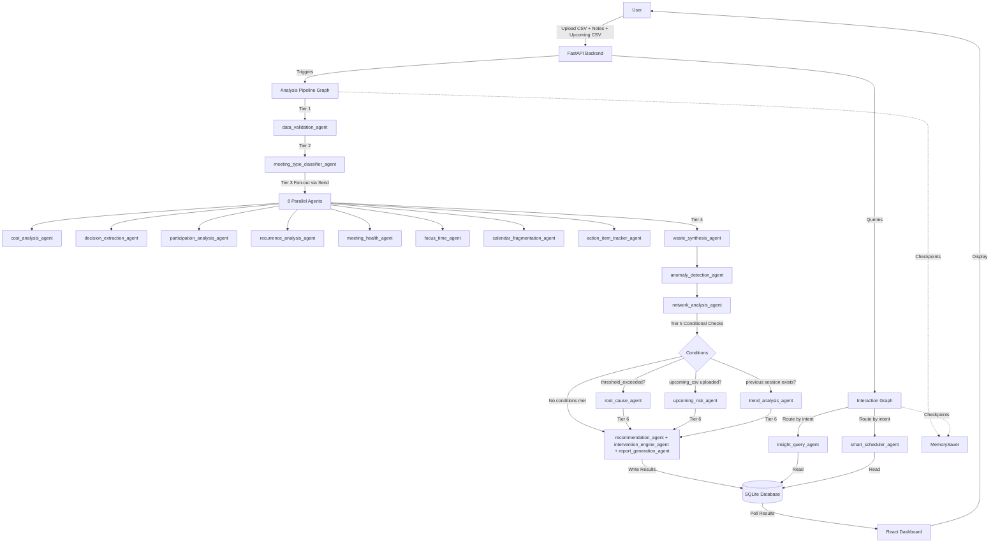
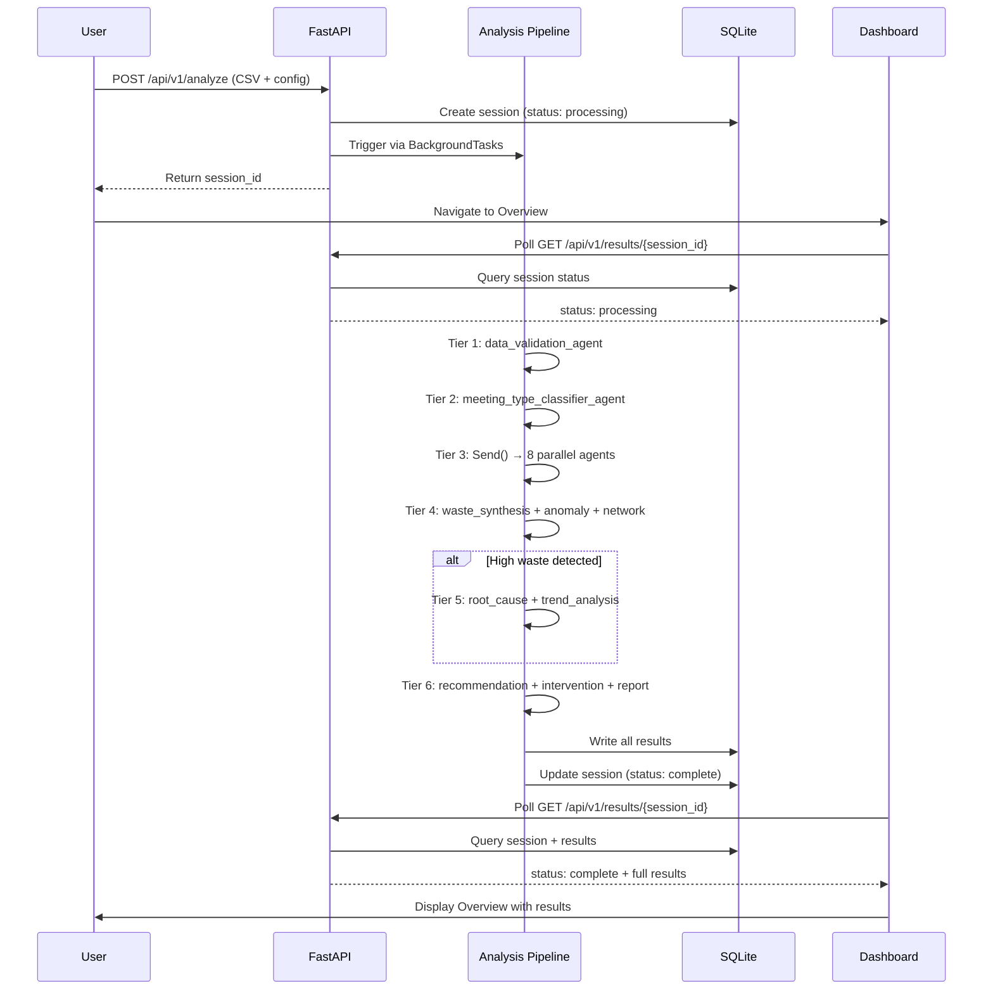

# Meetrix Implementation Plan

## System Overview

**Meetrix** is an all-in-one meeting intelligence platform that makes invisible meeting waste visible and quantifiable for organisations. It covers the complete meeting lifecycle: intelligent scheduling before a meeting is created, deep observability across the organisation's meeting culture, and continuous improvement tracking to measure whether interventions are working.

**Tagline:** "Schedule smarter. Understand deeper. Waste less."

**Core Value Proposition:**
Meetrix answers five questions simultaneously:
1. What is being wasted? (cost, time, focus)
2. Who is suffering? (people in meeting overload)
3. Are meetings actually productive? (decision output, health scores)
4. Is it getting better or worse? (trend analysis, forecasting)
5. How does the organisation compare? (network topology, cascade detection)

**Competitive Positioning:**
- Microsoft Viva Insights analyses meetings but sends data to Microsoft's cloud and cannot schedule
- Clockwise schedules but does not analyse culture or predict waste
- Reclaim optimises calendars but has no intelligence layer
- **Meetrix is the only platform that covers scheduling, analysis, prediction, intervention, and improvement in a single on-premise deployment**

For financial services, healthcare, and government — IBM's primary customer base — on-premise is not a preference, it is a compliance requirement.

**Primary Use Cases:**
- Upload historical calendar data and receive a complete meeting waste analysis within minutes
- Identify specific meetings to cancel, merge, shorten, or restructure with AI-generated justifications
- Detect cascade chains where one underprepared meeting spawned multiple expensive follow-ups
- Schedule new meetings intelligently with waste probability predictions and generated agendas
- Ask natural language questions about meeting patterns and receive data-backed answers
- Track improvement over time as interventions are applied

**Out of Scope:**
- Real-time calendar API integration (CSV upload only for MVP)
- Multi-tenant deployment (single organisation per instance)
- Mobile applications (web dashboard only)
- Video call transcription (notes are manually uploaded)
- External benchmarking data (industry averages are hardcoded)

**Architecture Diagram:**



---

## Agent Inventory

### Tier 1: Ingestion

#### `data_validation_agent`

| Field | Value |
|-------|-------|
| Role | Parse and normalise uploaded CSV data, validate all fields, compute derived values |
| Model | N/A (pure Python logic) |
| Tools | None |
| Receives | Raw CSV string, config dict (hourly_rate, weights) |
| Returns | `validated_meetings: list[Meeting]`, `errors: list[str]` |
| Style | Custom async node function |

**Responsibilities:**
- Parse CSV with flexible column mapping (required: title, start, end, attendees)
- Validate EmailStr format for all attendee and organizer fields
- Compute `duration_minutes` from start/end timestamps
- Detect and flag malformed rows
- Continue processing with valid rows only
- Append validation errors to `state.errors`

**NOT responsible for:**
- Interpreting meeting content or purpose
- Calculating costs (delegated to cost_analysis_agent)
- Classifying meeting types (delegated to meeting_type_classifier_agent)

**System Prompt Summary:**
N/A (deterministic logic)

---

### Tier 2: Classification

#### `meeting_type_classifier_agent`

| Field | Value |
|-------|-------|
| Role | Classify each meeting into one of 7 types based on title, attendees, duration, and notes |
| Model | `llama3.2` (configurable via `CLASSIFIER_MODEL`) |
| Tools | None |
| Receives | `validated_meetings: list[Meeting]` |
| Returns | `meeting_classifications: list[MeetingClassification]` |
| Style | Custom async node with `with_structured_output()`, temperature=0.0 |

**Responsibilities:**
- Classify each meeting as: standup / planning / decision / status-update / brainstorm / 1:1 / social
- Assign confidence score (0.0-1.0) to each classification
- Use meeting title, attendee count, duration, and notes_text as classification signals
- Process meetings in batches of 15 to avoid exceeding context window
- Calls `get_llm(model_name, temperature=0.0)` to prevent malformed structured output

**NOT responsible for:**
- Determining meeting quality or waste
- Extracting decisions or action items
- Recommending changes

**System Prompt Summary:**
"You are a meeting type classifier. Given a meeting's title, attendee count, duration, and optional notes, classify it into exactly one of these types: standup, planning, decision, status-update, brainstorm, 1:1, social. Return a MeetingClassification object with the meeting_id, meeting_type, and confidence score. Use these heuristics: standups are <30min with >5 people and 'standup' or 'daily' in title; 1:1s have exactly 2 attendees; planning meetings have 'planning' or 'roadmap' in title; decision meetings have 'decision' or 'approval' in title; brainstorms have 'brainstorm' or 'ideation' in title; status-updates have 'status' or 'update' in title; social meetings have 'lunch' or 'coffee' or 'happy hour' in title. If none match, default to status-update with low confidence."

---

### Tier 3: Parallel Analysis (8 agents via Send())

#### `cost_analysis_agent`

| Field | Value |
|-------|-------|
| Role | Calculate raw meeting cost using duration, attendee count, and hourly rates |
| Model | N/A (pure Python logic) |
| Tools | None |
| Receives | `validated_meetings: list[Meeting]`, `config.hourly_rate: float`, optional per-person rate overrides |
| Returns | `parallel_analysis['cost']: dict[UUID, float]` (meeting_id → cost) |
| Style | Custom async node function |

**Responsibilities:**
- Compute cost per meeting: `(duration_minutes / 60) × attendee_count × hourly_rate`
- Use per-person rate overrides where available, fall back to default rate
- Store results keyed by meeting_id

**NOT responsible for:**
- Determining if cost is justified
- Comparing cost to industry benchmarks
- Recommending cost reductions

**System Prompt Summary:**
N/A (deterministic logic)

---

#### `decision_extraction_agent`

| Field | Value |
|-------|-------|
| Role | Extract documented decisions and action items from meeting notes using LLM |
| Model | `llama3.2` (configurable via `DECISION_EXTRACTION_MODEL`) |
| Tools | None |
| Receives | `validated_meetings: list[Meeting]` (only those with `notes_text` populated) |
| Returns | `parallel_analysis['decisions']: dict[UUID, list[str]]` (meeting_id → decision list) |
| Style | Custom async node with `with_structured_output()`, temperature=0.0 |

**Responsibilities:**
- Read `notes_text` for each meeting
- Extract explicit decisions (e.g., "We decided to...", "Approved:", "Action:")
- Return structured list of decision strings per meeting
- Return empty list if no decisions found
- Process meetings in batches of 15 to avoid exceeding context window
- Calls `get_llm(model_name, temperature=0.0)` to prevent malformed structured output

**NOT responsible for:**
- Judging decision quality
- Tracking whether decisions were implemented
- Extracting action items (delegated to action_item_tracker_agent)

**System Prompt Summary:**
"You are a decision extraction specialist. Read the meeting notes and extract all documented decisions. A decision is an explicit statement of what was agreed, approved, or chosen. Examples: 'We decided to launch in Q2', 'Approved budget increase to $50k', 'Chose vendor A over vendor B'. Return a list of decision strings. If no decisions are documented, return an empty list. Do not infer decisions from discussion — only extract what is explicitly stated."

---

#### `participation_analysis_agent`

| Field | Value |
|-------|-------|
| Role | Analyse attendee participation patterns: required vs optional ratio, organizer recurrence |
| Model | N/A (pure Python logic) |
| Tools | None |
| Receives | `validated_meetings: list[Meeting]` |
| Returns | `parallel_analysis['participation']: dict[UUID, dict]` (meeting_id → {optional_ratio, organizer_recurrence_count}) |
| Style | Custom async node function |

**Responsibilities:**
- Calculate ratio of optional to required attendees (if data available)
- Count how many meetings each organizer has created in the dataset
- Detect patterns of over-invitation (>50% optional attendees)

**NOT responsible for:**
- Determining who should or shouldn't attend
- Analysing actual participation during the meeting (no transcript data)
- Recommending attendee changes

**System Prompt Summary:**
N/A (deterministic logic)

---

#### `recurrence_analysis_agent`

| Field | Value |
|-------|-------|
| Role | Detect staleness in recurring meetings via attendance trends and outcome history |
| Model | N/A (pure Python logic) |
| Tools | None |
| Receives | `validated_meetings: list[Meeting]` |
| Returns | `parallel_analysis['recurrence']: dict[UUID, dict]` (meeting_id → {staleness_score, attendance_drop_percentage}) |
| Style | Custom async node function |

**Responsibilities:**
- Group meetings by title + organizer to detect recurring series
- Calculate attendance drop percentage over time (if multiple instances exist)
- Flag recurring meetings with >6 months history and no documented decisions in last 3 occurrences
- Compute staleness score (0.0-1.0, higher = more stale)

**NOT responsible for:**
- Deciding whether to cancel recurring meetings
- Analysing meeting content quality
- Recommending recurrence frequency changes

**System Prompt Summary:**
N/A (deterministic logic)

---

#### `meeting_health_agent`

| Field | Value |
|-------|-------|
| Role | Score meeting hygiene: agenda present, duration appropriate for type, attendee fit |
| Model | `llama3.2` (configurable via `MEETING_HEALTH_MODEL`) |
| Tools | None |
| Receives | `validated_meetings: list[Meeting]`, `meeting_classifications: list[MeetingClassification]` |
| Returns | `meeting_health_scores: list[MeetingHealth]` |
| Style | Custom async node with `with_structured_output()`, temperature=0.3 |

**Responsibilities:**
- Check if meeting notes contain an agenda (keywords: "Agenda:", "Topics:", numbered list)
- Assess if duration is appropriate for meeting type (e.g., standups should be <30min, planning >60min)
- Score attendee fit: does attendee count match meeting type expectations?
- Compute overall health score (0.0-1.0)
- Process meetings in batches of 15 to avoid exceeding context window
- Calls `get_llm(model_name, temperature=0.3)` for scoring task

**NOT responsible for:**
- Determining meeting outcomes or value
- Recommending specific changes
- Analysing decision quality

**System Prompt Summary:**
"You are a meeting health assessor. For each meeting, evaluate: (1) Does it have an agenda? Look for 'Agenda:', 'Topics:', or numbered lists in notes. (2) Is the duration appropriate for its type? Standups should be <30min, 1:1s 30-60min, planning >60min, brainstorms >45min. (3) Is the attendee count appropriate? Standups 5-15, 1:1s exactly 2, planning 4-10, brainstorms 4-8. Return a MeetingHealth object with has_agenda (bool), duration_appropriate (bool), attendee_fit_score (0.0-1.0), and overall_health_score (0.0-1.0 weighted average)."

---

#### `focus_time_agent`

| Field | Value |
|-------|-------|
| Role | Calculate remaining uninterrupted focus blocks per person per day after meetings |
| Model | N/A (pure Python logic) |
| Tools | None |
| Receives | `validated_meetings: list[Meeting]` |
| Returns | `focus_scores: list[FocusTimeScore]` |
| Style | Custom async node function |

**Responsibilities:**
- Group meetings by person (from attendee_emails)
- Calculate total meeting hours per person
- Compute remaining focus blocks (contiguous 2+ hour periods without meetings)
- Calculate focus percentage: `(total_work_hours - meeting_hours) / total_work_hours`
- Flag individuals with <20% focus time as critical, <35% as warning

**NOT responsible for:**
- Recommending which meetings to cancel
- Analysing meeting quality
- Tracking actual work output

**System Prompt Summary:**
N/A (deterministic logic)

---

#### `calendar_fragmentation_agent`

| Field | Value |
|-------|-------|
| Role | Detect back-to-back meeting chains and context-switching costs per person |
| Model | N/A (pure Python logic) |
| Tools | None |
| Receives | `validated_meetings: list[Meeting]` |
| Returns | `parallel_analysis['fragmentation']: dict[str, dict]` (person_email → {chain_count, max_chain_length, context_switches_per_day}) |
| Style | Custom async node function |

**Responsibilities:**
- Detect back-to-back meeting chains (meetings with <15min gap between them)
- Count context switches per person per day (number of meeting-to-meeting transitions)
- Calculate maximum chain length (longest uninterrupted meeting sequence)

**NOT responsible for:**
- Recommending schedule changes
- Analysing meeting content
- Determining optimal meeting spacing

**System Prompt Summary:**
N/A (deterministic logic)

---

#### `action_item_tracker_agent`

| Field | Value |
|-------|-------|
| Role | Extract action items and owners from notes, check follow-through signals in subsequent uploads |
| Model | `llama3.2` (configurable via `ACTION_ITEM_MODEL`) |
| Tools | None |
| Receives | `validated_meetings: list[Meeting]` (only those with `notes_text` populated) |
| Returns | `action_items: list[ActionItem]` |
| Style | Custom async node with `with_structured_output()`, temperature=0.0 |

**Responsibilities:**
- Extract action items from meeting notes (keywords: "Action:", "TODO:", "@person will...")
- Identify assignee email if mentioned
- Mark `followed_through` as null in MVP (future: check subsequent uploads for completion signals)
- Process meetings in batches of 15 to avoid exceeding context window
- Calls `get_llm(model_name, temperature=0.0)` to prevent malformed structured output

**NOT responsible for:**
- Tracking action item completion across systems (no Jira/Linear integration)
- Determining action item priority
- Recommending action item changes

**System Prompt Summary:**
"You are an action item extractor. Read meeting notes and extract all action items. An action item is a specific task assigned to a person. Examples: 'John will send the proposal by Friday', 'Action: Sarah to schedule follow-up', 'TODO: Review design mockups'. Return an ActionItem object with meeting_id, description, and assignee_email (if mentioned). If no assignee is mentioned, set assignee_email to null. Do not infer action items from general discussion."

---

### Tier 4: Synthesis

#### `waste_synthesis_agent`

| Field | Value |
|-------|-------|
| Role | Apply weighted formula to compute composite waste score from parallel analysis dimensions |
| Model | N/A (pure Python logic) |
| Tools | None |
| Receives | `parallel_analysis: dict[str, Any]`, `config.weights: dict[str, float]` |
| Returns | `waste_scores: list[WasteScore]` |
| Style | Custom async node function |

**Responsibilities:**
- Normalise each dimension (cost, decision_deficit, participation_imbalance, recurrence_staleness) to 0.0-1.0
- Apply configurable weights (default: cost 0.35, decision 0.30, participation 0.20, recurrence 0.15)
- Compute composite score: weighted sum of available dimensions
- Renormalise weights if any dimension is missing (sum to 1.0 across present dimensions)
- Assign category: High Waste (≥0.70), Medium Waste (≥0.40), Low Waste (≥0.25), High Value (<0.25)
- Set `threshold_exceeded` flag if composite_score ≥ HIGH_WASTE_THRESHOLD

**NOT responsible for:**
- Generating narrative explanations (delegated to root_cause_agent)
- Recommending actions (delegated to recommendation_agent)
- Determining causality

**System Prompt Summary:**
N/A (deterministic logic)

---

#### `anomaly_detection_agent`

| Field | Value |
|-------|-------|
| Role | Flag statistical outliers and detect cascade chains |
| Model | N/A (pure Python logic) |
| Tools | None |
| Receives | `validated_meetings: list[Meeting]`, `waste_scores: list[WasteScore]`, `focus_scores: list[FocusTimeScore]` |
| Returns | `anomalies: list[Anomaly]`, `cascade_chains: list[CascadeChain]` |
| Style | Custom async node function |

**Responsibilities:**
- Detect doubled meeting hours for any person week-over-week
- Flag attendance spikes (meeting with >2× average attendee count)
- Detect sudden individual overload (person goes from <50% to >80% meeting time in one week)
- **Cascade detection:** When a meeting has `decision_deficit > 0.8`, scan 72 hours following it for meetings with >40% attendee overlap. Flag as cascade chain. Compute total cascade cost across chain.
- Assign severity: low / medium / high

**NOT responsible for:**
- Explaining why anomalies occurred
- Recommending interventions
- Predicting future anomalies

**System Prompt Summary:**
N/A (deterministic logic)

---

#### `network_analysis_agent`

| Field | Value |
|-------|-------|
| Role | Build meeting co-occurrence network, compute centrality scores, identify bottleneck people |
| Model | N/A (pure Python logic) |
| Tools | None |
| Receives | `validated_meetings: list[Meeting]`, `focus_scores: list[FocusTimeScore]` |
| Returns | `network_graph: NetworkGraph` |
| Style | Custom async node function |

**Responsibilities:**
- Build graph: nodes = people, edges = co-occurrence in meetings
- Compute centrality score per person (degree centrality: how many unique people they meet with)
- Calculate combined cost per edge (sum of all meetings where both people attended)
- Identify most central person (highest centrality)
- Identify highest cost pair (edge with maximum combined cost)
- Flag at-risk people (centrality >75th percentile AND focus_percentage <35%)

**NOT responsible for:**
- Recommending organisational changes
- Analysing team structure
- Predicting collaboration patterns

**System Prompt Summary:**
N/A (deterministic logic)

---

### Tier 5: Conditional Deep Analysis (three independent conditional checks)

#### `root_cause_agent`

| Field | Value |
|-------|-------|
| Role | Generate narrative explanation for high-waste meetings |
| Model | `llama3.2` (configurable via `ROOT_CAUSE_MODEL`) |
| Tools | None |
| Receives | `waste_scores: list[WasteScore]` (filtered to `threshold_exceeded == true`), `meeting_classifications`, `parallel_analysis` |
| Returns | `root_causes: dict[str, str]` (meeting_id → narrative) |
| Style | Custom async node with `with_structured_output()`, temperature=0.5 |

**Responsibilities:**
- For each high-waste meeting, generate 2-3 paragraph narrative explaining:
  - Which dimension(s) drove the high score
  - Specific evidence from the data (e.g., "23 of 25 attendees marked optional")
  - Likely root cause (e.g., "Meeting has outlived its original purpose")
- Use meeting type, dimension breakdown, and notes as context
- Calls `get_llm(model_name, temperature=0.5)` for narrative generation

**NOT responsible for:**
- Recommending specific actions (delegated to recommendation_agent)
- Generating interventions (delegated to intervention_engine_agent)
- Scoring or categorising meetings

**System Prompt Summary:**
"You are a meeting waste diagnostician. For each high-waste meeting, explain WHY it scored poorly. Use the dimension breakdown: if decision_deficit is high, explain that no decisions were documented. If participation_imbalance is high, explain the optional vs required ratio. If recurrence_staleness is high, explain the attendance drop and lack of outcomes. If cost_factor is high, explain the duration and attendee count. Write 2-3 paragraphs in professional, direct language. Do not recommend actions — only diagnose the problem."

**Conditional:** Fires only when `any(ws.threshold_exceeded for ws in state['waste_scores'])` is true.

---

#### `trend_analysis_agent`

| Field | Value |
|-------|-------|
| Role | Compare current period vs previous uploads when multiple datasets exist |
| Model | N/A (pure Python logic) |
| Tools | None |
| Receives | Current `waste_scores`, previous session `waste_scores` from SQLite (if exists) |
| Returns | `parallel_analysis['trends']: dict` (period-over-period deltas) |
| Style | Custom async node function |

**Responsibilities:**
- Query SQLite for previous session's waste_scores (if exists)
- Calculate delta: average waste score, total cost, high-waste count
- Compute trend direction: improving / worsening / stable
- Project forecast: if current trend continues, when will critical threshold be reached?

**NOT responsible for:**
- Explaining why trends changed
- Recommending interventions
- Predicting specific meeting outcomes

**System Prompt Summary:**
N/A (deterministic logic)

**Conditional:** Fires only when SQLite contains a completed session prior to the current one, regardless of threshold_exceeded status.

---

#### `upcoming_risk_agent`

| Field | Value |
|-------|-------|
| Role | Score future meetings from uploaded upcoming CSV for waste probability using historical patterns from the current session |
| Model | `llama3.2` (configurable via `UPCOMING_RISK_MODEL`) |
| Tools | None |
| Receives | Raw upcoming_csv string (from uploaded_files), `validated_meetings` (historical), `waste_scores`, `meeting_classifications` |
| Returns | `upcoming_risks: list[UpcomingRisk]` |
| Style | Custom async node with `with_structured_output()`, temperature=0.5 |

**Responsibilities:**
- Parse upcoming_csv using same column schema as historical CSV
- For each upcoming meeting, query historical waste_scores for meetings with similar attendee combinations, meeting type, and time slot
- Compute waste_probability (0.0–1.0) based on: attendee overload (focus_percentage of proposed attendees), historical waste rate for this attendee group, meeting type's average waste score, organizer's historical waste rate
- Generate risk_factors list (specific reasons this meeting is at risk)
- Generate recommended_intervention (one sentence action to take before the meeting)
- Return empty list if upcoming_csv was not uploaded (not an error)
- Calls `get_llm(model_name, temperature=0.5)` for risk prediction

**NOT responsible for:**
- Scheduling meetings (delegated to smart_scheduler_agent)
- Modifying historical data
- Generating recommendations for past meetings

**System Prompt Summary:**
"You are a meeting risk predictor. Given an upcoming meeting's details and historical waste patterns for similar meetings, predict the waste probability (0.0–1.0). Identify specific risk factors: is the organizer historically low on documented decisions? Are attendees already at >80% meeting time? Has this group had high-waste meetings before? Generate a one-sentence recommended intervention. Return an UpcomingRisk object."

**Conditional:** Fires only when `uploaded_files` contains 'upcoming_csv'.

---

### Tier 6: Output Generation

#### `recommendation_agent`

| Field | Value |
|-------|-------|
| Role | Generate structured, prioritised recommendations for all meetings |
| Model | `llama3.2` (configurable via `RECOMMENDATION_MODEL`) |
| Tools | None |
| Receives | `waste_scores: list[WasteScore]`, `meeting_classifications`, `root_causes` (if available) |
| Returns | `recommendations: list[Recommendation]` |
| Style | Custom async node with `with_structured_output()`, temperature=0.0 |

**Responsibilities:**
- For each meeting, generate a Recommendation object with:
  - `recommended_action`: Literal["cancel", "merge", "shorten", "restructure", "keep"]
  - `reasoning`: 1-2 sentence justification
  - `priority`: 1 (highest) to 5 (lowest)
- Prioritise by: waste score × cost (highest impact first)
- Constrain action vocabulary to the 5 Literal options
- Calls `get_llm(model_name, temperature=0.0)` to prevent malformed structured output

**NOT responsible for:**
- Generating pre-meeting emails or agendas (delegated to intervention_engine_agent)
- Explaining root causes (delegated to root_cause_agent)
- Tracking whether recommendations were implemented

**System Prompt Summary:**
"You are a meeting improvement advisor. For each meeting, recommend ONE action from this list: cancel, merge, shorten, restructure, keep. Use these rules: cancel if waste score >0.80 and recurring with no decisions; merge if multiple meetings have >60% attendee overlap; shorten if duration >2× expected for type; restructure if participation_imbalance >0.70; keep if waste score <0.40. Provide 1-2 sentence reasoning. Assign priority 1-5 based on waste score × cost (highest = priority 1). Return a Recommendation object."

---

#### `intervention_engine_agent`

| Field | Value |
|-------|-------|
| Role | Generate ready-to-use intervention materials for high-waste recurring meetings |
| Model | `llama3.2` (configurable via `INTERVENTION_MODEL`) |
| Tools | None |
| Receives | `waste_scores: list[WasteScore]` (filtered to `threshold_exceeded == true AND is_recurring == true`), `meeting_classifications`, `root_causes` |
| Returns | `interventions: list[Intervention]` |
| Style | Custom async node with `with_structured_output()`, temperature=0.3 |

**Responsibilities:**
- For each qualifying meeting, generate:
  - `pre_meeting_email_template`: Professional email from organizer to attendees, clarifying purpose, required decisions, who genuinely needs to attend (copyable from dashboard)
  - `suggested_agenda`: 4-6 agenda items with time allocations
  - `recommended_attendee_reduction`: List of emails who can receive async summary instead
  - `alternative_format`: Specific suggestion (e.g., "Replace 60min weekly sync with 10min async Loom + 20min monthly decision meeting")
- Calls `get_llm(model_name, temperature=0.3)` for template generation

**NOT responsible for:**
- Sending emails (user copies template)
- Enforcing attendance changes
- Tracking intervention effectiveness

**System Prompt Summary:**
"You are a meeting intervention specialist. For each high-waste recurring meeting, generate: (1) A professional pre-meeting email template the organizer can send. Include: meeting purpose, required decisions, who needs to attend and why, who can receive a summary instead. Tone: direct but respectful. (2) A suggested agenda with 4-6 items and time allocations. (3) A list of attendee emails who can be moved to async updates. (4) An alternative format suggestion (e.g., replace weekly 60min with monthly 30min + async updates). Return an Intervention object."

---

#### `report_generation_agent`

| Field | Value |
|-------|-------|
| Role | Synthesise all outputs into structured executive summary and compute Meetrix Score |
| Model | `llama3.2` (configurable via `REPORT_GENERATION_MODEL`) |
| Tools | None |
| Receives | All analysis results: `waste_scores`, `recommendations`, `anomalies`, `cascade_chains`, `network_graph`, `roi_projection`, `focus_scores`, `meeting_health_scores` |
| Returns | `executive_report: ExecutiveReport` |
| Style | Custom async node with `with_structured_output()`, temperature=0.5 |

**Responsibilities:**
- Generate executive summary: 3-4 paragraphs covering:
  - Period analysed, total meetings, total cost
  - Headline finding (e.g., "£340k spent on meetings with zero documented decisions")
  - Top 3 specific problems (e.g., "Engineering leadership sync has run 8 months with no outcomes")
  - Trend direction (improving / worsening / stable)
- Extract top 5 key findings as bullet points
- Extract top 5 recommendations as action items
- Include ROI projection summary
- Compute Meetrix Score (0-100) using formula:
  ```
  meetrix_score = max(0, round(100
    - (average_composite_waste_score * 60)
    - (focus_time_penalty * 25)
    - (health_score_penalty * 15)))
  ```
  Where:
  - `focus_time_penalty` = percentage of people with focus_percentage < 0.35
  - `health_score_penalty` = 1 - average overall_health_score across all meetings
- Calls `get_llm(model_name, temperature=0.5)` for executive summary generation

**NOT responsible for:**
- Detailed meeting-level analysis (available in dashboard)
- Generating interventions
- Tracking implementation

**System Prompt Summary:**
"You are an executive briefing writer. Synthesise the meeting analysis into a 3-4 paragraph summary suitable for leadership. Start with the headline number: total cost, total meetings, waste percentage. Highlight the single most damning finding (e.g., a cascade chain that cost £34k, a recurring meeting with 8 months of no decisions). Describe the trend direction. Extract 5 key findings as bullet points. Extract 5 top recommendations as action items. Write in direct, professional language. No jargon. No hedging. This is evidence, not opinion."

---

### Separate Compiled Graph: Interaction Agents

#### `insight_query_agent`

| Field | Value |
|-------|-------|
| Role | Translate natural language dashboard queries into structured lookups against stored SQLite results |
| Model | `llama3.2` (configurable via `INSIGHT_QUERY_MODEL`, can override to `phi3:mini` for speed) |
| Tools | None (reads directly from SQLite via Python) |
| Receives | `InsightRequest`: session_id, query (str) |
| Returns | `InsightResponse`: answer (str), relevant_meeting_ids (list[str]) |
| Style | Custom async node with `with_structured_output()`, temperature=0.5 |

**Responsibilities:**
- Parse natural language query (e.g., "Which team should we fix first?")
- Query SQLite for relevant data (waste_scores, focus_scores, network_graph, cascade_chains)
- Generate direct answer with supporting specifics (meeting names, costs, person names)
- Return list of relevant meeting_ids for drill-down
- Maintain multi-turn conversation context via MemorySaver
- Calls `get_llm(model_name, temperature=0.5)` for conversational responses

**NOT responsible for:**
- Running new analyses (reads stored results only)
- Modifying data
- Generating recommendations (reads existing recommendations)

**System Prompt Summary:**
"You are Ask Meetrix, a conversational assistant that answers questions about meeting analysis results. You have access to stored waste scores, focus scores, network data, cascade chains, and recommendations. When asked a question, query the relevant tables, compute the answer, and respond in 2-3 sentences with specific numbers and names. Examples: 'Which team is most over-meetinged?' → Query focus_scores, group by team, return team with lowest average focus_percentage. 'What would cancelling our top 3 wasteful meetings save?' → Query waste_scores ordered by composite_score DESC limit 3, sum their costs, multiply by 52 weeks. Always cite specific meeting titles and person names from the data."

---

#### `smart_scheduler_agent`

| Field | Value |
|-------|-------|
| Role | Intelligent meeting scheduling with waste probability prediction and generated agendas |
| Model | `llama3.2` (configurable via `SCHEDULER_MODEL`) |
| Tools | None (reads stored analysis results as context) |
| Receives | `ScheduleRequest`: session_id, purpose, required_decisions, proposed_attendees, preferred_week, duration_preference, meeting_type_hint |
| Returns | `MeetingProposal`: suggested_slots, recommended_duration, meeting_type_prediction, required_attendees, async_update_candidates, generated_agenda, waste_probability, waste_risk_factors, success_conditions, ical_export |
| Style | Custom async node with `with_structured_output()`, temperature=0.5 |

**Responsibilities:**
- Query stored analysis for each proposed attendee using session_id: current focus_percentage, centrality score, meeting burden, historical waste patterns
- Predict waste probability based on: attendee overload, meeting type, decision count, duration
- Generate 3 ranked time slot options with waste probability per slot
- Recommend duration based on decision count and meeting type
- Split attendees into required-in-person vs async-update candidates
- Generate agenda with time allocations per item
- List waste risk factors (e.g., "3 attendees already at 85% meeting time")
- List success conditions (e.g., "Document at least 2 decisions", "Keep to 30min")
- Generate iCal export string
- Calls `get_llm(model_name, temperature=0.5)` for scheduling recommendations

**NOT responsible for:**
- Actually booking the meeting (user exports .ics)
- Enforcing attendance
- Tracking meeting outcomes

**System Prompt Summary:**
"You are a smart meeting scheduler. Given a meeting purpose, required decisions, and proposed attendees, recommend: (1) Three time slots in the preferred week, ranked by waste probability (consider attendee overload, back-to-back chains, focus time impact). (2) Recommended duration based on decision count and meeting type. (3) Split attendees into required vs async-update candidates (move people with >80% meeting time to async unless critical). (4) Generate an agenda with 4-6 items and time allocations. (5) List waste risk factors (what could make this meeting fail). (6) List success conditions (what must happen for this to be valuable). Return a MeetingProposal object."

---

## Orchestration Topology

**Pattern:** Single StateGraph for analysis pipeline + separate StateGraph for interaction agents

**Analysis Pipeline Graph:**
- Entry point: `data_validation_agent` receives uploaded CSV and config
- Tier 1 → Tier 2 → Tier 3 (fan-out via `Send()`) → Tier 4 → Conditional Tier 5 → Tier 6
- State accumulates through each tier
- Tier 3 fan-out: `Send()` dispatches 8 agents in parallel, `waste_synthesis_agent` fires once all complete
- Tier 5 has three independent conditional checks:
  1. **threshold_exceeded check**: If `any(ws.threshold_exceeded for ws in state['waste_scores'])` → fire `root_cause_agent`
  2. **upcoming_csv check**: If `'upcoming_csv' in state['uploaded_files']` → fire `upcoming_risk_agent`
  3. **previous_session check**: If SQLite contains a completed session prior to current one → fire `trend_analysis_agent`
- All three Tier 5 agents can run in parallel if all conditions are met
- If no conditions are met, skip directly to Tier 6
- Tier 6 agents run in parallel: `recommendation_agent`, `intervention_engine_agent`, `report_generation_agent`
- Final node writes all results to SQLite and updates session status to "complete"

**Interaction Graph:**
- Entry point: routing node determines intent (insight query vs scheduling request)
- Routes to either `insight_query_agent` or `smart_scheduler_agent`
- Both agents read from stored SQLite results
- Maintains conversation context via MemorySaver with thread_id

**Communication:**
- Analysis pipeline: state flows sequentially, no inter-agent communication
- Interaction graph: single-turn or multi-turn conversation, no inter-agent communication
- Both graphs use MemorySaver for checkpointing

**Sequence Diagram (Primary Workflow):**



---

## Data Flow and Contracts

### State Schema

**AnalysisState (TypedDict):**

```python
class AnalysisState(TypedDict):
    session_id: str
    uploaded_files: dict[str, str]  # filename → content
    config: dict[str, Any]  # hourly_rate, weights
    validated_meetings: list[Meeting]
    meeting_classifications: list[MeetingClassification]
    parallel_analysis: dict[str, Any]  # keyed by agent name
    waste_scores: list[WasteScore]
    focus_scores: list[FocusTimeScore]
    meeting_health_scores: list[MeetingHealth]
    action_items: list[ActionItem]
    anomalies: list[Anomaly]
    cascade_chains: list[CascadeChain]
    network_graph: NetworkGraph | None
    upcoming_risks: list[UpcomingRisk]
    root_causes: dict[str, str] | None  # meeting_id → narrative
    recommendations: list[Recommendation]
    interventions: list[Intervention]
    executive_report: ExecutiveReport | None
    roi_projection: ROIProjection | None
    errors: list[str]
```

**ScheduleState (TypedDict):**

```python
class ScheduleState(TypedDict):
    session_id: str
    request: ScheduleRequest
    proposal: MeetingProposal | None
    errors: list[str]
```

### Pydantic Models

All models defined in `backend/app/models/schemas.py`. Shared between LangGraph state and FastAPI response schemas. No translation layer.

**Meeting:**
```python
class Meeting(BaseModel):
    meeting_id: UUID
    title: str
    start_datetime: datetime
    end_datetime: datetime
    duration_minutes: int  # computed from start/end
    attendee_emails: list[EmailStr]
    organizer_email: EmailStr | None
    is_recurring: bool
    recurrence_rule: str | None
    meeting_type: str | None  # populated by classifier
    notes_text: str | None
```

**WasteScore:**
```python
class WasteScore(BaseModel):
    meeting_id: UUID
    cost_factor: float  # 0.0-1.0 normalised
    decision_deficit: float  # 0.0-1.0
    participation_imbalance: float  # 0.0-1.0
    recurrence_staleness: float  # 0.0-1.0
    composite_score: float  # 0.0-1.0 weighted
    category: Literal["High Waste", "Medium Waste", "Low Waste", "High Value"]
    threshold_exceeded: bool
```

**Recommendation:**
```python
class Recommendation(BaseModel):
    meeting_id: UUID
    recommended_action: Literal["cancel", "merge", "shorten", "restructure", "keep"]
    reasoning: str
    priority: int  # 1 = highest
```

**MeetingClassification:**
```python
class MeetingClassification(BaseModel):
    meeting_id: UUID
    meeting_type: Literal["standup", "planning", "decision", "status-update", "brainstorm", "1:1", "social"]
    confidence: float  # 0.0-1.0
```

**FocusTimeScore:**
```python
class FocusTimeScore(BaseModel):
    person_email: str
    total_meeting_hours: float
    focus_blocks_remaining: int
    longest_focus_block_minutes: int
    focus_percentage: float  # 0.0-1.0
```

**MeetingHealth:**
```python
class MeetingHealth(BaseModel):
    meeting_id: UUID
    has_agenda: bool
    duration_appropriate: bool
    attendee_fit_score: float  # 0.0-1.0
    overall_health_score: float  # 0.0-1.0
```

**ActionItem:**
```python
class ActionItem(BaseModel):
    meeting_id: UUID
    description: str
    assignee_email: str | None
    followed_through: bool | None  # null in MVP
```

**Anomaly:**
```python
class Anomaly(BaseModel):
    entity_id: str  # meeting_id or person_email
    entity_type: Literal["meeting", "person", "team"]
    anomaly_type: str  # e.g., "doubled_hours", "attendance_spike"
    severity: Literal["low", "medium", "high"]
    description: str
```

**CascadeChain:**
```python
class CascadeChain(BaseModel):
    origin_meeting_id: UUID
    spawned_meeting_ids: list[UUID]
    total_cascade_cost: float
    cascade_depth: int
```

**UpcomingRisk:**
```python
class UpcomingRisk(BaseModel):
    upcoming_meeting_id: UUID
    title: str
    scheduled_datetime: datetime
    attendee_emails: list[EmailStr]
    waste_probability: float  # 0.0-1.0
    risk_factors: list[str]
    recommended_intervention: str
```

**PersonNode:**
```python
class PersonNode(BaseModel):
    email: str
    display_name: str
    total_meeting_hours: float
    centrality_score: float  # 0.0-1.0
    focus_percentage: float  # 0.0-1.0
    at_risk: bool
```

**MeetingEdge:**
```python
class MeetingEdge(BaseModel):
    person_a: str
    person_b: str
    co_occurrence_count: int
    combined_cost: float
```

**NetworkGraph:**
```python
class NetworkGraph(BaseModel):
    nodes: list[PersonNode]
    edges: list[MeetingEdge]
    most_central_person: str
    highest_cost_pair: tuple[str, str]
```

**Intervention:**
```python
class Intervention(BaseModel):
    meeting_id: UUID
    pre_meeting_email_template: str
    suggested_agenda: list[str]
    recommended_attendee_reduction: list[EmailStr]
    alternative_format: str
```

**ExecutiveReport:**
```python
class ExecutiveReport(BaseModel):
    period: str
    total_cost: float
    total_meetings: int
    meetrix_score: int  # 0-100, computed formula
    summary: str  # 3-4 paragraphs
    key_findings: list[str]  # top 5
    top_recommendations: list[str]  # top 5
    trend_direction: Literal["improving", "worsening", "stable"]
    data_residency: str = "on-premise"
```

**ROIProjection:**
```python
class ROIProjection(BaseModel):
    projected_annual_saving: float
    weeks_to_break_even: int
    top_changes: list[str]
    assumptions: list[str]
```

**ScheduleRequest:**
```python
class ScheduleRequest(BaseModel):
    session_id: str  # Required — used to query stored analysis for attendee focus scores and historical waste patterns
    purpose: str
    required_decisions: list[str]
    proposed_attendees: list[EmailStr]
    preferred_week: date
    duration_preference: int | None  # minutes
    meeting_type_hint: str | None
```

**SummaryStats:**
```python
class SummaryStats(BaseModel):
    total_meetings: int
    total_cost: float
    average_waste_score: float
    high_waste_count: int
    meetrix_score: int  # 0-100
    people_in_overload: int  # focus_percentage < 0.35
    cascade_chains_count: int
    upcoming_risks_count: int
```

**TimeSlot:**
```python
class TimeSlot(BaseModel):
    day: date
    start_time: time
    end_time: time
    attendee_overload_count: int
    waste_probability: float  # 0.0-1.0
```

**MeetingProposal:**
```python
class MeetingProposal(BaseModel):
    suggested_slots: list[TimeSlot]  # 3 ranked options
    recommended_duration: int  # minutes
    meeting_type_prediction: str
    required_attendees: list[EmailStr]
    async_update_candidates: list[EmailStr]
    generated_agenda: list[str]
    waste_probability: float  # 0.0-1.0
    waste_risk_factors: list[str]
    success_conditions: list[str]
    ical_export: str
```

### Batching Strategy

LLM agents that process per-meeting data (`meeting_type_classifier_agent`, `decision_extraction_agent`, `meeting_health_agent`, `action_item_tracker_agent`) must process meetings in batches to avoid exceeding the context window (num_ctx=4096).

**Batch size:** 15 meetings per LLM call.

**Implementation:**
- Each agent iterates meetings in batches of 15
- Calls `ChatOllama` once per batch with `with_structured_output()`
- Parses structured output (list of results)
- Accumulates results across batches
- Returns complete list after all batches processed

**Error handling:**
- If a batch fails or times out, that batch's meetings receive empty results
- Errors appended to `state.errors` with batch number
- Pipeline continues with results from successful batches
- The 60-second timeout applies per batch call, not per meeting

**Example:**
```python
# Pseudocode for batched LLM agent
async def meeting_type_classifier_agent(state):
    meetings = state['validated_meetings']
    batch_size = 15
    all_classifications = []
    
    for i in range(0, len(meetings), batch_size):
        batch = meetings[i:i+batch_size]
        try:
            async with asyncio.timeout(60):
                results = await llm.with_structured_output(MeetingClassification).ainvoke(batch)
                all_classifications.extend(results)
        except asyncio.TimeoutError:
            state['errors'].append(f"Batch {i//batch_size + 1} timed out")
            # Continue with next batch
    
    return {"meeting_classifications": all_classifications}
```

---

### Data Validation

**Validation Responsibility:**
- `data_validation_agent` validates all CSV input: EmailStr format, datetime parsing, required fields present
- FastAPI request models validate API input: Pydantic validation on all POST bodies
- SQLite schema enforces foreign keys and NOT NULL constraints
- LLM agents with `with_structured_output()` enforce Pydantic model structure on LLM responses

**Error Handling:**
- CSV validation errors appended to `state.errors`, pipeline continues with valid rows
- API validation errors return 400 with error details
- LLM output validation errors caught, logged, agent returns empty result

---

## API Design

### `POST /api/v1/analyze`

| Field | Value |
|-------|-------|
| Purpose | Upload calendar data and trigger analysis pipeline |
| Auth | None (MVP) |
| Request | Multipart form: `historical_csv` (file), `upcoming_csv` (file, optional), `notes_files` (list[file], optional), `config` (JSON string: `{"hourly_rate": 75.0, "weights": {...}}`) |
| Response | `{"session_id": "uuid"}` |
| Errors | 400 Bad Request (invalid CSV format), 503 Service Unavailable (Ollama unreachable) |
| Streaming | No |

**Behaviour:**
1. Parse multipart form
2. Create session in SQLite with status "processing"
3. Trigger analysis pipeline via FastAPI BackgroundTasks
4. Return session_id immediately
5. Pipeline runs asynchronously, updates session status on completion

---

### `GET /api/v1/results/{session_id}`

| Field | Value |
|-------|-------|
| Purpose | Retrieve analysis results for a session |
| Auth | None (MVP) |
| Request | Path parameter: `session_id` |
| Response | `AnalysisResponse` (see below) |
| Errors | 404 Not Found (invalid session_id) |
| Streaming | No (polling endpoint) |

**AnalysisResponse:**
```python
class AnalysisResponse(BaseModel):
    session_id: str
    status: Literal["processing", "complete", "failed"]
    error_message: str | None
    waste_scores: list[WasteScore]
    meeting_classifications: list[MeetingClassification]
    recommendations: list[Recommendation]
    focus_scores: list[FocusTimeScore]
    meeting_health_scores: list[MeetingHealth]
    action_items: list[ActionItem]
    anomalies: list[Anomaly]
    cascade_chains: list[CascadeChain]
    network_graph: NetworkGraph | None
    upcoming_risks: list[UpcomingRisk]
    interventions: list[Intervention]
    executive_report: ExecutiveReport | None
    roi_projection: ROIProjection | None
    summary_stats: SummaryStats
```

**Behaviour:**
- Frontend polls this endpoint every 3 seconds until status is "complete"
- Returns partial results during processing (empty lists for incomplete tiers)
- Returns full results when status is "complete"

---

### `GET /api/v1/sessions/{session_id}/agent-status`

| Field | Value |
|-------|-------|
| Purpose | Retrieve live agent execution status for AgentExecutionPanel |
| Auth | None (MVP) |
| Request | Path parameter: `session_id` |
| Response | `{"agents": list[AgentEvent]}` |
| Errors | 404 Not Found (invalid session_id) |
| Streaming | No (polling endpoint) |

**AgentEvent:**
```python
class AgentEvent(BaseModel):
    agent_name: str
    tier: int
    status: Literal["queued", "running", "complete", "failed", "skipped"]
    started_at: datetime | None
    completed_at: datetime | None
    error_message: str | None
```

**Behaviour:**
- Frontend polls this endpoint every 1 second during analysis
- Returns list of all 18 pipeline agents with current status
- Used to populate AgentExecutionPanel on Overview page

---

### `POST /api/v1/insights`

| Field | Value |
|-------|-------|
| Purpose | Ask natural language questions about stored analysis results |
| Auth | None (MVP) |
| Request | `InsightRequest`: `{"session_id": "uuid", "query": "Which team should we fix first?"}` |
| Response | `InsightResponse`: `{"answer": "Engineering team...", "relevant_meeting_ids": ["uuid1", "uuid2"]}` |
| Errors | 404 Not Found (invalid session_id), 400 Bad Request (empty query) |
| Streaming | No |

**Behaviour:**
- Routes to `insight_query_agent` in Interaction Graph
- Agent queries SQLite for relevant data
- Returns direct answer with supporting specifics
- Maintains conversation context via MemorySaver

---

### `POST /api/v1/schedule`

| Field | Value |
|-------|-------|
| Purpose | Generate intelligent meeting proposal with waste probability prediction |
| Auth | None (MVP) |
| Request | `ScheduleRequest` (see Pydantic model above) |
| Response | `MeetingProposal` (see Pydantic model above) |
| Errors | 404 Not Found (invalid session_id), 400 Bad Request (invalid request) |
| Streaming | No |

**Behaviour:**
- Routes to `smart_scheduler_agent` in Interaction Graph
- Agent queries stored analysis for attendee context
- Generates 3 ranked time slot options
- Returns complete meeting proposal with agenda and risk factors

---

### `GET /api/v1/health`

| Field | Value |
|-------|-------|
| Purpose | Check service health and Ollama connectivity |
| Auth | None (MVP) |
| Request | None |
| Response | `{"status": "healthy", "ollama_connected": true, "privacy_summary": {...}}` |
| Errors | 503 Service Unavailable (Ollama unreachable) |
| Streaming | No |

**Behaviour:**
- Checks Ollama connectivity via test request
- Returns SQLite status
- Returns privacy summary: `{"llm": "local", "storage": "local", "network_calls": "none"}`

---

## Provider Configuration

### Ollama Setup

**Base URL:** `http://host.docker.internal:11434` (default)
- Works on Mac and Windows Docker Desktop automatically
- Linux requires `extra_hosts: host.docker.internal:host-gateway` in docker-compose.yml

**Model Assignments:**

All models configurable via environment variables, all default to `llama3.2`:

| Agent | Environment Variable | Default | Rationale |
|-------|---------------------|---------|-----------|
| meeting_type_classifier_agent | CLASSIFIER_MODEL | llama3.2 | Fast classification, runs on most machines |
| decision_extraction_agent | DECISION_EXTRACTION_MODEL | llama3.2 | Structured extraction, reliable output |
| meeting_health_agent | MEETING_HEALTH_MODEL | llama3.2 | Scoring task, moderate complexity |
| action_item_tracker_agent | ACTION_ITEM_MODEL | llama3.2 | Extraction task, similar to decisions |
| root_cause_agent | ROOT_CAUSE_MODEL | llama3.2 | Narrative generation, benefits from reasoning |
| recommendation_agent | RECOMMENDATION_MODEL | llama3.2 | Constrained output, reliable with llama3.2 |
| intervention_engine_agent | INTERVENTION_MODEL | llama3.2 | Template generation, moderate complexity |
| report_generation_agent | REPORT_GENERATION_MODEL | llama3.2 | Executive summary, benefits from reasoning |
| insight_query_agent | INSIGHT_QUERY_MODEL | llama3.2 (can override to phi3:mini) | Interactive queries, speed matters for UX |
| smart_scheduler_agent | SCHEDULER_MODEL | llama3.2 | Complex reasoning, benefits from larger model |
| upcoming_risk_agent | UPCOMING_RISK_MODEL | llama3.2 | Risk prediction, benefits from reasoning |

**Ollama Generation Parameters:**

Configured per agent via `get_llm()` factory in `backend/app/llm.py`:

```python
def get_llm(model_name: str, temperature: float = 0.1) -> ChatOllama:
    return ChatOllama(
        model=model_name,
        base_url=settings.OLLAMA_BASE_URL,
        temperature=temperature,
        num_ctx=4096,  # Context window (Ollama default 2048 is too small)
        num_predict=2048,  # Max tokens to generate
        keep_alive="5m",  # Keep model loaded between calls
    )
```

**Temperature Strategy:**
- Default changed from 0.7 to 0.1 as a safety floor
- Callers pass temperature explicitly per agent:
  - **temperature=0.0**: meeting_type_classifier, decision_extraction, action_item_tracker, recommendation (prevents malformed structured output)
  - **temperature=0.3**: meeting_health, intervention_engine
  - **temperature=0.5**: root_cause, report_generation, insight_query, smart_scheduler, upcoming_risk

**Model Loading Strategy:**
- Models are loaded on-demand by Ollama
- `keep_alive="5m"` keeps models in memory between calls
- First call to each model incurs loading latency (~5-10s for llama3.2)
- Subsequent calls are fast (<1s)

---

## Environment Variables

All variables are optional with sensible defaults. Managed via `pydantic-settings` `BaseSettings` in `backend/app/config.py`.

| Variable | Type | Default | Description |
|----------|------|---------|-------------|
| **Ollama** |
| OLLAMA_BASE_URL | str | http://host.docker.internal:11434 | Ollama server URL |
| **Model Overrides** |
| CLASSIFIER_MODEL | str | llama3.2 | Model for meeting_type_classifier_agent |
| DECISION_EXTRACTION_MODEL | str | llama3.2 | Model for decision_extraction_agent |
| MEETING_HEALTH_MODEL | str | llama3.2 | Model for meeting_health_agent |
| ACTION_ITEM_MODEL | str | llama3.2 | Model for action_item_tracker_agent |
| ROOT_CAUSE_MODEL | str | llama3.2 | Model for root_cause_agent |
| RECOMMENDATION_MODEL | str | llama3.2 | Model for recommendation_agent |
| INTERVENTION_MODEL | str | llama3.2 | Model for intervention_engine_agent |
| REPORT_GENERATION_MODEL | str | llama3.2 | Model for report_generation_agent |
| INSIGHT_QUERY_MODEL | str | llama3.2 | Model for insight_query_agent |
| SCHEDULER_MODEL | str | llama3.2 | Model for smart_scheduler_agent |
| UPCOMING_RISK_MODEL | str | llama3.2 | Model for upcoming_risk_agent |
| **Cost Configuration** |
| DEFAULT_HOURLY_RATE | float | 75.0 | Default hourly rate for cost calculation |
| **Dimension Weights** |
| WEIGHT_COST | float | 0.35 | Weight for cost_factor dimension |
| WEIGHT_DECISION | float | 0.30 | Weight for decision_deficit dimension |
| WEIGHT_PARTICIPATION | float | 0.20 | Weight for participation_imbalance dimension |
| WEIGHT_RECURRENCE | float | 0.15 | Weight for recurrence_staleness dimension |
| **Waste Thresholds** |
| HIGH_WASTE_THRESHOLD | float | 0.70 | Composite score threshold for high waste |
| MEDIUM_WASTE_THRESHOLD | float | 0.40 | Composite score threshold for medium waste |
| **Timeouts** |
| LLM_TIMEOUT_SECONDS | int | 60 | Timeout per LLM agent call |
| PARALLEL_STAGE_TIMEOUT_SECONDS | int | 300 | Timeout for entire Tier 3 parallel stage |
| **Infrastructure** |
| DATABASE_PATH | str | /app/data/meetrix.db | SQLite database path (absolute, inside container) |
| LOG_LEVEL | str | INFO | Logging verbosity (DEBUG/INFO/WARNING/ERROR) |
| API_PORT | int | 8000 | FastAPI server port |
| CORS_ALLOWED_ORIGINS | str | http://localhost:5173 | CORS allowed origins (comma-separated) |

**Example `.env` file:**

```env
# Ollama
OLLAMA_BASE_URL=http://host.docker.internal:11434

# Model overrides (all default to llama3.2)
# CLASSIFIER_MODEL=llama3.2
# INSIGHT_QUERY_MODEL=phi3:mini  # Override for speed

# Cost configuration
DEFAULT_HOURLY_RATE=75.0

# Dimension weights (must sum to 1.0)
WEIGHT_COST=0.35
WEIGHT_DECISION=0.30
WEIGHT_PARTICIPATION=0.20
WEIGHT_RECURRENCE=0.15

# Waste thresholds
HIGH_WASTE_THRESHOLD=0.70
MEDIUM_WASTE_THRESHOLD=0.40

# Timeouts
LLM_TIMEOUT_SECONDS=60
PARALLEL_STAGE_TIMEOUT_SECONDS=300

# Infrastructure
DATABASE_PATH=/app/data/meetrix.db
LOG_LEVEL=INFO
API_PORT=8000
CORS_ALLOWED_ORIGINS=http://localhost:5173
```

---

## Project Structure

Complete directory tree of files to be generated:

```
meetrix/
├── .bob/                                    # Bob configuration (already exists)
│   ├── custom_modes.yaml
│   ├── mcp.json
│   ├── rules/
│   │   └── 0_project_context.md
│   ├── rules-deep-plan/
│   │   ├── 1_questioning_protocol.xml
│   │   └── 2_implementation_md_format.xml
│   └── skills/
│       ├── grill-me/
│       │   └── SKILL.md
│       ├── lint/
│       │   └── SKILL.md
│       └── neo-brutalism/
│           └── SKILL.md
├── backend/
│   ├── app/
│   │   ├── __init__.py
│   │   ├── main.py                          # FastAPI app entry point, lifespan with Ollama check, graph compilation
│   │   ├── config.py                        # Pydantic Settings, all env vars
│   │   ├── llm.py                           # get_llm() factory — ChatOllama instance per call
│   │   ├── database.py                      # SQLite connection, schema creation, seed_demo_data()
│   │   ├── api/
│   │   │   └── v1/
│   │   │       └── routes.py                # All 6 API endpoints
│   │   ├── graph/
│   │   │   ├── __init__.py
│   │   │   ├── state.py                     # AnalysisState, ScheduleState TypedDict classes
│   │   │   ├── logic_nodes.py               # Logic agents: data_validation, cost_calculation, waste_synthesis, etc.
│   │   │   ├── llm_nodes.py                 # LLM agents: meeting_type_classifier, decision_extraction, etc.
│   │   │   ├── analysis_builder.py          # Analysis pipeline StateGraph construction + compile
│   │   │   └── interaction_builder.py       # Interaction graph StateGraph construction + compile
│   │   ├── models/
│   │   │   └── schemas.py                   # All 16 Pydantic models
│   │   └── utils/
│   │       ├── csv_parser.py                # CSV parsing with flexible column mapping
│   │       └── agent_logger.py              # Writes to agent_events table
│   ├── fixtures/
│   │   └── seed_novacorp.py                 # Python script to seed NovaCorp demo dataset
│   ├── tests/
│   │   ├── __init__.py
│   │   ├── conftest.py                      # Shared fixtures (mock_llm, test_db)
│   │   ├── test_logic_agents.py             # Unit tests for all logic agents
│   │   ├── test_llm_agents.py               # Unit tests for LLM agents with fixture responses
│   │   ├── test_pipeline.py                 # Integration test (requires Ollama, marked)
│   │   └── test_api.py                      # FastAPI TestClient tests
│   ├── Dockerfile                           # Python 3.11-slim, pip install, uvicorn
│   ├── .dockerignore                        # Excludes .env, __pycache__, .venv
│   ├── requirements.txt                     # All Python dependencies
│   └── pyproject.toml                       # pytest config: asyncio_mode = "auto"
├── frontend/
│   ├── src/
│   │   ├── main.tsx                         # React entry point
│   │   ├── App.tsx                          # Router + SessionContext provider
│   │   ├── contexts/
│   │   │   └── SessionContext.tsx           # Global session state, polling hook
│   │   ├── lib/
│   │   │   └── api.ts                       # Typed fetch wrapper, maps to backend Pydantic models
│   │   ├── hooks/
│   │   │   └── useAnalysisPolling.ts        # Polls /api/v1/results every 3s
│   │   ├── components/
│   │   │   ├── Shell.tsx                    # Persistent sidebar + header
│   │   │   ├── AgentExecutionPanel.tsx      # Live agent status display
│   │   │   ├── MeetrixScore.tsx             # Large colour-coded score badge
│   │   │   ├── UpcomingRiskCard.tsx         # Risk card with waste probability
│   │   │   ├── MeetingTable.tsx             # Sortable filterable table
│   │   │   ├── MeetingSlideOver.tsx         # Full-screen meeting detail view
│   │   │   ├── PersonCard.tsx               # Person grid card with focus bar
│   │   │   ├── NetworkGraph.tsx             # Force-directed graph (D3.js or similar)
│   │   │   ├── InsightQuery.tsx             # Natural language query input
│   │   │   └── ScheduleForm.tsx             # Smart scheduling form
│   │   ├── pages/
│   │   │   ├── Overview.tsx                 # Page 1: headline metrics, agent panel, top 5 worst
│   │   │   ├── Schedule.tsx                 # Page 2: smart scheduling interface
│   │   │   ├── AskMeetrix.tsx               # Page 3: conversational query interface
│   │   │   ├── Meetings.tsx                 # Page 4: tabbed meeting table
│   │   │   ├── People.tsx                   # Page 5: grid/calendar view toggle
│   │   │   ├── Network.tsx                  # Page 6: force-directed graph
│   │   │   ├── Health.tsx                   # Page 7: meeting type breakdown
│   │   │   ├── Trends.tsx                   # Page 8: Meetrix Score chart, forecast
│   │   │   ├── Reports.tsx                  # Page 9: executive briefing
│   │   │   └── Settings.tsx                 # Page 10: upload, config, privacy
│   │   ├── styles/
│   │   │   └── index.css                    # Tailwind imports + neo-brutalism tokens
│   │   └── vite-env.d.ts
│   ├── public/
│   │   └── meetrix-logo.svg
│   ├── index.html
│   ├── package.json
│   ├── package-lock.json
│   ├── tsconfig.json                        # TypeScript strict mode
│   ├── vite.config.ts                       # Vite dev server, proxy to backend
│   ├── tailwind.config.js                   # Tailwind + neo-brutalism theme
│   ├── postcss.config.js
│   ├── Dockerfile                           # Node 20-slim, npm ci, vite dev
│   └── .dockerignore                        # Excludes node_modules, .env
├── docker-compose.yml                       # Backend + frontend services, SQLite volume
├── .env.example                             # All env vars with defaults and descriptions
├── .gitignore
├── README.md                                # Quick start, architecture overview
├── idea.md                                  # Problem statement (already exists)
└── implementation.md                        # This file
```

---

## SQLite Schema

**Database:** `meetrix.db` (mounted as Docker volume at `/app/data/meetrix.db`)

**Connection Setup:**
```python
import sqlite3

conn = sqlite3.connect(DATABASE_PATH)
conn.execute("PRAGMA foreign_keys = ON")  # Enable foreign key constraints
```

### Table Definitions

#### `sessions`

```sql
CREATE TABLE sessions (
    session_id TEXT PRIMARY KEY,
    status TEXT NOT NULL CHECK(status IN ('processing', 'complete', 'failed')),
    error_message TEXT,
    created_at TIMESTAMP DEFAULT CURRENT_TIMESTAMP,
    completed_at TIMESTAMP
);

CREATE INDEX idx_sessions_status ON sessions(status);
CREATE INDEX idx_sessions_created ON sessions(created_at DESC);
```

---

#### `meetings`

```sql
CREATE TABLE meetings (
    meeting_id TEXT PRIMARY KEY,
    session_id TEXT NOT NULL,
    title TEXT NOT NULL,
    start_datetime TIMESTAMP NOT NULL,
    end_datetime TIMESTAMP NOT NULL,
    duration_minutes INTEGER NOT NULL,
    attendee_emails TEXT NOT NULL,  -- JSON array
    organizer_email TEXT,
    is_recurring BOOLEAN DEFAULT 0,
    recurrence_rule TEXT,
    meeting_type TEXT,
    notes_text TEXT,
    created_at TIMESTAMP DEFAULT CURRENT_TIMESTAMP,
    FOREIGN KEY (session_id) REFERENCES sessions(session_id)
);

CREATE INDEX idx_meetings_session ON meetings(session_id);
CREATE INDEX idx_meetings_start ON meetings(start_datetime);
CREATE INDEX idx_meetings_type ON meetings(meeting_type);
```

---

#### `waste_scores`

```sql
CREATE TABLE waste_scores (
    id INTEGER PRIMARY KEY AUTOINCREMENT,
    meeting_id TEXT NOT NULL,
    session_id TEXT NOT NULL,
    cost_factor REAL,
    decision_deficit REAL,
    participation_imbalance REAL,
    recurrence_staleness REAL,
    composite_score REAL NOT NULL,
    category TEXT NOT NULL CHECK(category IN ('High Waste', 'Medium Waste', 'Low Waste', 'High Value')),
    threshold_exceeded BOOLEAN DEFAULT 0,
    FOREIGN KEY (meeting_id) REFERENCES meetings(meeting_id),
    FOREIGN KEY (session_id) REFERENCES sessions(session_id)
);

CREATE INDEX idx_waste_session ON waste_scores(session_id);
CREATE INDEX idx_waste_meeting ON waste_scores(meeting_id);
CREATE INDEX idx_waste_score ON waste_scores(composite_score DESC);
CREATE INDEX idx_waste_threshold ON waste_scores(session_id, threshold_exceeded);
```

---

#### `recommendations`

```sql
CREATE TABLE recommendations (
    id INTEGER PRIMARY KEY AUTOINCREMENT,
    meeting_id TEXT NOT NULL,
    session_id TEXT NOT NULL,
    recommended_action TEXT NOT NULL CHECK(recommended_action IN ('cancel', 'merge', 'shorten', 'restructure', 'keep')),
    reasoning TEXT NOT NULL,
    priority INTEGER NOT NULL,
    FOREIGN KEY (meeting_id) REFERENCES meetings(meeting_id),
    FOREIGN KEY (session_id) REFERENCES sessions(session_id)
);

CREATE INDEX idx_rec_session ON recommendations(session_id);
CREATE INDEX idx_rec_priority ON recommendations(session_id, priority);
```

---

#### `meeting_health_scores`

```sql
CREATE TABLE meeting_health_scores (
    id INTEGER PRIMARY KEY AUTOINCREMENT,
    meeting_id TEXT NOT NULL,
    session_id TEXT NOT NULL,
    has_agenda BOOLEAN,
    duration_appropriate BOOLEAN,
    attendee_fit_score REAL,
    overall_health_score REAL NOT NULL,
    FOREIGN KEY (meeting_id) REFERENCES meetings(meeting_id),
    FOREIGN KEY (session_id) REFERENCES sessions(session_id)
);

CREATE INDEX idx_health_session ON meeting_health_scores(session_id);
CREATE INDEX idx_health_score ON meeting_health_scores(overall_health_score DESC);
```

---

#### `focus_scores`

```sql
CREATE TABLE focus_scores (
    id INTEGER PRIMARY KEY AUTOINCREMENT,
    session_id TEXT NOT NULL,
    person_email TEXT NOT NULL,
    total_meeting_hours REAL,
    focus_blocks_remaining INTEGER,
    longest_focus_block_minutes INTEGER,
    focus_percentage REAL,
    FOREIGN KEY (session_id) REFERENCES sessions(session_id)
);

CREATE INDEX idx_focus_session ON focus_scores(session_id);
CREATE INDEX idx_focus_person ON focus_scores(session_id, person_email);
CREATE INDEX idx_focus_percentage ON focus_scores(focus_percentage);
```

---

#### `anomalies`

```sql
CREATE TABLE anomalies (
    id INTEGER PRIMARY KEY AUTOINCREMENT,
    session_id TEXT NOT NULL,
    entity_id TEXT NOT NULL,
    entity_type TEXT NOT NULL CHECK(entity_type IN ('meeting', 'person', 'team')),
    anomaly_type TEXT NOT NULL,
    severity TEXT NOT NULL CHECK(severity IN ('low', 'medium', 'high')),
    description TEXT NOT NULL,
    FOREIGN KEY (session_id) REFERENCES sessions(session_id)
);

CREATE INDEX idx_anomaly_session ON anomalies(session_id);
CREATE INDEX idx_anomaly_severity ON anomalies(session_id, severity);
```

---

#### `cascade_chains`

```sql
CREATE TABLE cascade_chains (
    id INTEGER PRIMARY KEY AUTOINCREMENT,
    session_id TEXT NOT NULL,
    origin_meeting_id TEXT NOT NULL,
    total_cascade_cost REAL NOT NULL,
    cascade_depth INTEGER NOT NULL,
    FOREIGN KEY (session_id) REFERENCES sessions(session_id),
    FOREIGN KEY (origin_meeting_id) REFERENCES meetings(meeting_id)
);

CREATE INDEX idx_cascade_session ON cascade_chains(session_id);
CREATE INDEX idx_cascade_cost ON cascade_chains(total_cascade_cost DESC);
```

---

#### `cascade_chain_meetings`

Junction table linking cascade chains to spawned meetings.

```sql
CREATE TABLE cascade_chain_meetings (
    chain_id INTEGER NOT NULL,
    meeting_id TEXT NOT NULL,
    FOREIGN KEY (chain_id) REFERENCES cascade_chains(id),
    FOREIGN KEY (meeting_id) REFERENCES meetings(meeting_id),
    PRIMARY KEY (chain_id, meeting_id)
);

CREATE INDEX idx_ccm_chain ON cascade_chain_meetings(chain_id);
CREATE INDEX idx_ccm_meeting ON cascade_chain_meetings(meeting_id);
```

---

#### `interventions`

```sql
CREATE TABLE interventions (
    id INTEGER PRIMARY KEY AUTOINCREMENT,
    meeting_id TEXT NOT NULL,
    session_id TEXT NOT NULL,
    pre_meeting_email_template TEXT NOT NULL,
    suggested_agenda TEXT NOT NULL,  -- JSON array
    recommended_attendee_reduction TEXT NOT NULL,  -- JSON array
    alternative_format TEXT NOT NULL,
    FOREIGN KEY (meeting_id) REFERENCES meetings(meeting_id),
    FOREIGN KEY (session_id) REFERENCES sessions(session_id)
);

CREATE INDEX idx_intervention_session ON interventions(session_id);
CREATE INDEX idx_intervention_meeting ON interventions(meeting_id);
```

---

#### `action_items`

```sql
CREATE TABLE action_items (
    id INTEGER PRIMARY KEY AUTOINCREMENT,
    meeting_id TEXT NOT NULL,
    session_id TEXT NOT NULL,
    description TEXT NOT NULL,
    assignee_email TEXT,
    followed_through BOOLEAN,
    FOREIGN KEY (meeting_id) REFERENCES meetings(meeting_id),
    FOREIGN KEY (session_id) REFERENCES sessions(session_id)
);

CREATE INDEX idx_action_session ON action_items(session_id);
CREATE INDEX idx_action_meeting ON action_items(meeting_id);
```

---

#### `network_nodes`

```sql
CREATE TABLE network_nodes (
    id INTEGER PRIMARY KEY AUTOINCREMENT,
    session_id TEXT NOT NULL,
    email TEXT NOT NULL,
    display_name TEXT NOT NULL,
    total_meeting_hours REAL,
    centrality_score REAL,
    focus_percentage REAL,
    at_risk BOOLEAN DEFAULT 0,
    FOREIGN KEY (session_id) REFERENCES sessions(session_id)
);

CREATE INDEX idx_node_session ON network_nodes(session_id);
CREATE INDEX idx_node_centrality ON network_nodes(centrality_score DESC);
```

---

#### `network_edges`

```sql
CREATE TABLE network_edges (
    id INTEGER PRIMARY KEY AUTOINCREMENT,
    session_id TEXT NOT NULL,
    person_a TEXT NOT NULL,
    person_b TEXT NOT NULL,
    co_occurrence_count INTEGER NOT NULL,
    combined_cost REAL NOT NULL,
    FOREIGN KEY (session_id) REFERENCES sessions(session_id)
);

CREATE INDEX idx_edge_session ON network_edges(session_id);
CREATE INDEX idx_edge_cost ON network_edges(combined_cost DESC);
```

---

#### `upcoming_risks`

```sql
CREATE TABLE upcoming_risks (
    id INTEGER PRIMARY KEY AUTOINCREMENT,
    session_id TEXT NOT NULL,
    meeting_id TEXT NOT NULL,
    title TEXT NOT NULL,
    scheduled_datetime TIMESTAMP NOT NULL,
    attendee_emails TEXT NOT NULL,  -- JSON array
    waste_probability REAL NOT NULL,
    risk_factors TEXT NOT NULL,  -- JSON array
    recommended_intervention TEXT NOT NULL,
    FOREIGN KEY (session_id) REFERENCES sessions(session_id)
);

CREATE INDEX idx_risk_session ON upcoming_risks(session_id);
CREATE INDEX idx_risk_probability ON upcoming_risks(waste_probability DESC);
```

---

#### `reports`

```sql
CREATE TABLE reports (
    id INTEGER PRIMARY KEY AUTOINCREMENT,
    session_id TEXT NOT NULL UNIQUE,
    period TEXT NOT NULL,
    total_cost REAL,
    total_meetings INTEGER,
    meetrix_score REAL NOT NULL,
    summary TEXT,
    key_findings TEXT NOT NULL,  -- JSON array
    top_recommendations TEXT NOT NULL,  -- JSON array
    trend_direction TEXT CHECK(trend_direction IN ('improving', 'worsening', 'stable')),
    data_residency TEXT NOT NULL DEFAULT 'All data processed and stored locally. No external API calls.',
    generated_at TIMESTAMP DEFAULT CURRENT_TIMESTAMP,
    FOREIGN KEY (session_id) REFERENCES sessions(session_id)
);

CREATE INDEX idx_report_session ON reports(session_id);
CREATE INDEX idx_report_score ON reports(meetrix_score DESC);
```

---

#### `roi_projections`

```sql
CREATE TABLE roi_projections (
    id INTEGER PRIMARY KEY AUTOINCREMENT,
    session_id TEXT NOT NULL UNIQUE,
    projected_annual_saving REAL NOT NULL,
    weeks_to_break_even INTEGER NOT NULL,
    top_changes TEXT NOT NULL,  -- JSON array
    assumptions TEXT NOT NULL,  -- JSON array
    FOREIGN KEY (session_id) REFERENCES sessions(session_id)
);

CREATE INDEX idx_roi_session ON roi_projections(session_id);
```

---

#### `agent_events`

Tracks agent execution for AgentExecutionPanel.

```sql
CREATE TABLE agent_events (
    id INTEGER PRIMARY KEY AUTOINCREMENT,
    session_id TEXT NOT NULL,
    agent_name TEXT NOT NULL,
    tier INTEGER NOT NULL,
    status TEXT NOT NULL CHECK(status IN ('queued', 'running', 'complete', 'failed', 'skipped')),
    started_at TIMESTAMP,
    completed_at TIMESTAMP,
    error_message TEXT,
    FOREIGN KEY (session_id) REFERENCES sessions(session_id)
);

CREATE INDEX idx_event_session ON agent_events(session_id);
CREATE INDEX idx_event_agent ON agent_events(session_id, agent_name);
```

---

## Error Handling and Failure Modes

### CSV Validation Failures

**Scenario:** Uploaded CSV has malformed rows (missing required fields, invalid email format, unparseable dates)

**Handling:**
1. `data_validation_agent` parses CSV row by row
2. Malformed rows appended to `state.errors` with specific error message
3. Valid rows continue through pipeline
4. If zero valid rows: return 400 immediately with full error list
5. If some valid rows: pipeline continues, errors included in final response

**User Experience:**
- Dashboard shows validation errors in a dismissible banner
- Valid meetings are analysed normally
- User can fix CSV and re-upload

---

### LLM Agent Timeouts

**Scenario:** LLM agent takes >60 seconds to respond (model overloaded, complex prompt, network issue)

**Handling:**
1. Each LLM agent wraps logic in `asyncio.wait_for(timeout=60)`
2. On `TimeoutError`: catch exception, append to `state.errors`, return empty result
3. Pipeline continues with available dimensions
4. `waste_synthesis_agent` renormalises weights across present dimensions
5. Dashboard marks missing dimensions as "unavailable" with tooltip

**User Experience:**
- Analysis completes with partial results
- Missing dimensions clearly indicated
- User can retry analysis if needed

---

### Parallel Stage Timeout

**Scenario:** Tier 3 parallel stage hangs due to unforeseen issue

**Handling:**
1. Entire Tier 3 wrapped in `asyncio.wait_for(timeout=300)` (5 minutes)
2. If stage doesn't resolve: `waste_synthesis_agent` receives partial results
3. Missing agents treated as timed out (empty results)
4. Pipeline continues with available data

**User Experience:**
- AgentExecutionPanel shows which agents timed out
- Analysis completes with partial results
- Session not marked as failed

---

### Ollama Unreachable

**Scenario:** Ollama service is down or unreachable

**Handling:**

**At Startup:**
1. FastAPI lifespan function checks Ollama connectivity
2. Test request to `/api/tags` endpoint
3. If unreachable: log fatal error and exit
4. Application refuses to start without Ollama

**During Request:**
1. LLM agent catches `httpx.ConnectError`
2. Append to `state.errors`: "Ollama connection failed"
3. Session marked as "failed" in SQLite
4. Return 503 from `/api/v1/results/{session_id}`

**User Experience:**
- Health check endpoint shows Ollama status
- Dashboard displays clear error: "AI service unavailable"
- User instructed to check Ollama is running

---

### Pipeline Crash

**Scenario:** Unhandled exception in pipeline node

**Handling:**
1. FastAPI BackgroundTasks catches exception
2. Session marked as "failed" in SQLite with error message
3. Error details preserved in `sessions.error_message`
4. No resume in MVP — user must re-upload

**User Experience:**
- Dashboard polls `/api/v1/results/{session_id}`
- Receives `status: "failed"` with error message
- User sees error banner with details
- "Retry Analysis" button triggers new upload

---

### Database Corruption

**Scenario:** SQLite file corrupted or locked

**Handling:**
1. Application startup checks database integrity
2. If corrupted: log error, attempt to recreate schema
3. If locked: retry with exponential backoff (3 attempts)
4. If unrecoverable: exit with clear error message

**User Experience:**
- Application fails to start
- Docker logs show clear error
- User instructed to delete volume and restart

---

## Demo Dataset: NovaCorp

**Purpose:** Pre-seeded SQLite fixture demonstrating all features without requiring user upload.

**Location:** `backend/fixtures/novacorp_demo.sql`

**Loading:** `seed_demo_data()` function in `backend/app/database.py`, called during FastAPI lifespan if `sessions` table is empty.

**Dataset Characteristics:**

- **Organisation:** NovaCorp, 150-person technology company
- **Period:** 90 days (Q1 2026)
- **Total Meetings:** 1,200
- **Teams:** Engineering (40 people), Product (25), Sales (50), Leadership (35)
- **Meetrix Score:** 31/100 (severe waste)

**Deliberately Severe Patterns:**

1. **High-Waste Recurring Meeting:**
   - Title: "Engineering Leadership Sync"
   - Frequency: Weekly, 60 minutes
   - Duration: 8 months (32 occurrences)
   - Last 14 occurrences: Zero documented decisions
   - Attendees: 12 (8 marked optional)
   - `decision_deficit`: 0.96
   - `participation_imbalance`: 0.67
   - `composite_score`: 0.89 (High Waste)
   - Annual cost: £37,440

2. **Participation Imbalance:**
   - Title: "Product Planning Review"
   - Attendees: 25 (23 marked optional)
   - Only 2 required attendees
   - `participation_imbalance`: 0.92
   - `composite_score`: 0.78 (High Waste)

3. **Cascade Chain:**
   - Origin: "Sprint Review - Unprepared"
   - `decision_deficit`: 0.94 (no decisions documented)
   - Spawned 6 follow-up meetings within 72 hours:
     - "Clarification Meeting"
     - "Re-Review Session"
     - "Stakeholder Alignment"
     - "Technical Deep-Dive"
     - "Decision Meeting"
     - "Final Approval"
   - Total cascade cost: £34,200
   - `cascade_depth`: 6

4. **Focus Time Crisis:**
   - 3 engineers with `focus_percentage` < 15%:
     - alice@novacorp.com: 12% (6.8 hours focus / 40 hour week)
     - bob@novacorp.com: 14% (5.6 hours focus)
     - charlie@novacorp.com: 11% (4.4 hours focus)
   - All flagged as `at_risk: true` in network graph

5. **Network Bottleneck:**
   - Most central person: david@novacorp.com (CTO)
   - Centrality score: 0.94 (meets with 94% of organisation)
   - Total meeting hours: 32/week (80% of work time)
   - Focus percentage: 18%

**Dashboard Population:**

All 10 pages fully populated on first load:

- **Overview:** Meetrix Score 31, £1.2M annual cost, 4 cascade chains, 12 people in overload
- **Schedule:** Smart scheduler has context for all 150 people
- **Ask Meetrix:** Can answer all suggested questions with real data
- **Meetings:** 1,200 meetings across all tabs, sortable/filterable
- **People:** 150 person cards, 12 flagged critical, 28 flagged warning
- **Network:** 150 nodes, 847 edges, clear bottleneck visualisation
- **Health:** Meeting type breakdown shows standups 0.82 health, planning 0.34 health
- **Trends:** 90-day history, forecast shows critical threshold in 6 weeks
- **Reports:** Executive summary with 5 key findings, 5 top recommendations
- **Settings:** Pre-configured with NovaCorp defaults

**No Upload Required:** User can explore the complete product immediately.

---

## Frontend Architecture

### Technology Stack

- **Framework:** React 18 with TypeScript (strict mode)
- **Build Tool:** Vite
- **Styling:** Tailwind CSS with neo-brutalism design system
- **Routing:** React Router v6
- **State Management:** React Context API (SessionContext)
- **Data Fetching:** Custom typed fetch wrapper in `src/lib/api.ts`
- **Charts:** Recharts or D3.js for visualisations
- **Network Graph:** D3.js force-directed layout

### Design System

**Deferred to `/neo-brutalism` skill.** When `frontend-craftsman` mode begins, activate the skill to load the complete design system specification. All components across all 10 pages follow the skill's rules without exception.

**Key Principles (from skill):**
- Thick black borders (2-3px, never 4px)
- Sharp corners (no border-radius)
- Bold drop shadows (8px offset)
- High contrast colour palette
- Monospace typography for data
- Flat, brutalist aesthetic

### SessionContext

**Purpose:** Global state management for analysis session and results.

**Location:** `frontend/src/contexts/SessionContext.tsx`

**State:**
```typescript
interface SessionState {
  sessionId: string | null;
  status: 'idle' | 'processing' | 'complete' | 'failed';
  results: AnalysisResponse | null;
  error: string | null;
}
```

**Methods:**
- `setSession(sessionId: string)` — Store session_id in sessionStorage
- `clearSession()` — Clear session and results
- `updateResults(results: AnalysisResponse)` — Cache latest results

**Persistence:** `sessionId` stored in `sessionStorage` so it survives page refreshes.

**Usage:** Every page reads from SessionContext, no local state duplication.

---

### useAnalysisPolling Hook

**Purpose:** Poll `/api/v1/results/{session_id}` every 3 seconds until status is "complete".

**Location:** `frontend/src/hooks/useAnalysisPolling.ts`

**Behaviour:**
1. Fires GET request every 3 seconds
2. Updates SessionContext with latest results
3. Stops polling when `status === "complete"` or `status === "failed"`
4. Resumes polling if page refreshes mid-analysis (reads sessionId from sessionStorage)

**Usage:**
```typescript
const { isPolling } = useAnalysisPolling(sessionId);
```

---

### API Client

**Location:** `frontend/src/lib/api.ts`

**Purpose:** Typed fetch wrapper that maps backend Pydantic models to TypeScript interfaces.

**Example:**
```typescript
export async function analyzeCalendar(
  files: FormData
): Promise<{ session_id: string }> {
  const response = await fetch(`${API_BASE_URL}/api/v1/analyze`, {
    method: 'POST',
    body: files,
  });
  if (!response.ok) throw new Error('Analysis failed');
  return response.json();
}

export async function getResults(
  sessionId: string
): Promise<AnalysisResponse> {
  const response = await fetch(`${API_BASE_URL}/api/v1/results/${sessionId}`);
  if (!response.ok) throw new Error('Failed to fetch results');
  return response.json();
}
```

**Environment Variable:** `VITE_BACKEND_URL` (default: `http://localhost:8000` in dev, `http://backend:8000` in Docker)

---

### Page Breakdown

#### Page 1: Overview

**Route:** `/`

**Components:**
- `MeetrixScore` — Large colour-coded score badge (0-100)
- `UpcomingRiskPanel` — List of `UpcomingRiskCard` components
- `AgentExecutionPanel` — Live agent status during analysis
- `MetricCard` × 4 — Annual cost, hours lost, people in overload, cascade chains
- `MeetingTable` — Top 5 worst meetings

**Data Sources:**
- `SessionContext.results.summary_stats`
- `SessionContext.results.upcoming_risks`
- `SessionContext.results.waste_scores` (sorted by composite_score DESC, limit 5)
- Poll `/api/v1/sessions/{session_id}/agent-status` every 1s during analysis

---

#### Page 2: Schedule

**Route:** `/schedule`

**Components:**
- `ScheduleForm` — Left panel with 4 inputs
- `MeetingProposal` — Right panel with 3 time slot cards, agenda, risk factors

**Behaviour:**
1. User fills form, clicks "Generate Proposal"
2. POST to `/api/v1/schedule`
3. Render `MeetingProposal` response
4. "Export as .ics" button downloads `proposal.ical_export`

---

#### Page 3: Ask Meetrix

**Route:** `/ask`

**Components:**
- `InsightQuery` — Large text input with suggested question chips
- `InsightAnswer` — Answer display with supporting data

**Behaviour:**
1. User types question or clicks suggestion
2. POST to `/api/v1/insights`
3. Render answer with relevant meeting links
4. Multi-turn conversation: previous Q&A pairs shown above input

---

#### Page 4: Meetings

**Route:** `/meetings`

**Components:**
- Tabs: All / High Waste / Recurring / Upcoming Risk / Cascade Chains
- `MeetingTable` — Sortable filterable table
- `MeetingSlideOver` — Full-screen detail view

**Behaviour:**
1. Click row → open slide-over
2. Slide-over shows: dimension breakdown, root cause narrative, intervention card, recommendation badge
3. Cascade chain tab shows tree visualisation

---

#### Page 5: People

**Route:** `/people`

**Components:**
- Tab toggle: Grid View / Calendar View
- Grid: `PersonCard` × N
- Calendar: Week grid per person with meeting blocks

**Behaviour:**
- Click person → filter Meetings page to their meetings
- Focus percentage bar colour-coded: green >50%, yellow 35-50%, orange 20-35%, red <20%

---

#### Page 6: Network

**Route:** `/network`

**Components:**
- `NetworkGraph` — Force-directed graph (D3.js)
- Right sidebar: Top 5 entangled pairs, Top 3 bottleneck people

**Behaviour:**
- Hover node → tooltip with name, hours, centrality
- Click node → filter Meetings page to that person
- Node size scales with centrality
- Node colour: green/yellow/red based on focus_percentage

---

#### Page 7: Health

**Route:** `/health`

**Components:**
- Meeting type breakdown cards
- Action item follow-through rate (large metric)
- Agenda compliance trend chart

**Data Sources:**
- `SessionContext.results.meeting_health_scores` grouped by meeting_type
- `SessionContext.results.action_items` (calculate follow-through rate)

---

#### Page 8: Trends

**Route:** `/trends`

**Components:**
- Meetrix Score line chart (historical + 4-week forecast)
- Cost per week bar chart
- Focus time trend line
- Anomaly event markers

**Data Sources:**
- Query SQLite for previous sessions (if exist)
- `SessionContext.results.executive_report.trend_direction`

---

#### Page 9: Reports

**Route:** `/reports`

**Components:**
- Executive briefing card (formatted text)
- Period selector (if multiple sessions exist)
- ROI projection section
- Copy buttons (markdown / plain text)

**Data Sources:**
- `SessionContext.results.executive_report`
- `SessionContext.results.roi_projection`

---

#### Page 10: Settings

**Route:** `/settings`

**Components:**
- Upload zones: Historical CSV, Upcoming CSV (optional), Notes files (optional)
- Cost config: hourly rate input with live preview
- Dimension weight sliders (sum to 1.0) with live Meetrix Score preview
- Model override dropdowns
- Privacy section with Ollama connectivity indicator

**Behaviour:**
1. User uploads files, configures settings
2. Click "Analyze" → POST to `/api/v1/analyze`
3. Store session_id in SessionContext
4. Redirect to Overview
5. Overview starts polling

---

### Persistent Shell

**Component:** `Shell.tsx`

**Structure:**
- Sidebar (always visible):
  - Meetrix logo + wordmark at top
  - Meetrix Score (large, colour-coded) below logo
  - Navigation links (10 pages)
  - Privacy strip pinned to bottom: "Local AI" / "Local DB" / "Zero Cloud"
- Main content area: `<Outlet />` from React Router

**Styling:** Neo-brutalism thick borders, sharp corners, high contrast.

---

### AgentExecutionPanel

**Component:** `AgentExecutionPanel.tsx`

**Purpose:** Live visualisation of pipeline execution on Overview page.

**Data Source:** Poll `/api/v1/sessions/{session_id}/agent-status` every 1 second during analysis.

**Display:**
- 18 agent cards grouped by tier
- Each card: agent name (uppercase), status badge (QUEUED/RUNNING/COMPLETE/FAILED/SKIPPED)
- RUNNING agents: animated pulsing border
- COMPLETE agents: solid black border
- FAILED agents: red border with error tooltip
- SKIPPED agents: grey with tooltip explaining conditional branch

**Header:** "X of 18 agents complete" with total elapsed time.

**Collapse:** After completion, panel collapses to summary bar showing total duration.

**Visual Impact:** When Tier 3 fires, all 8 parallel agents transition from QUEUED to RUNNING simultaneously — this is the moment that makes the architecture undeniable.

---

## Deployment

### Docker Compose Setup

**File:** `docker-compose.yml`

**Services:**

#### Backend Service

```yaml
services:
  backend:
    build:
      context: ./backend
      dockerfile: Dockerfile
    ports:
      - "8000:8000"
    volumes:
      - meetrix-data:/app/data
    environment:
      OLLAMA_BASE_URL: http://host.docker.internal:11434
      DEFAULT_HOURLY_RATE: 75.0
      LOG_LEVEL: INFO
      DATABASE_PATH: /app/data/meetrix.db
      CORS_ALLOWED_ORIGINS: http://localhost:5173
    extra_hosts:
      - "host.docker.internal:host-gateway"  # Linux support
    restart: unless-stopped
```

#### Frontend Service

```yaml
  frontend:
    build:
      context: ./frontend
      dockerfile: Dockerfile
    ports:
      - "5173:5173"
    environment:
      VITE_BACKEND_URL: http://backend:8000
    depends_on:
      - backend
    restart: unless-stopped
```

#### Volume

```yaml
volumes:
  meetrix-data:
    driver: local
```

**Network:** Default bridge network (implicit).

---

### Backend Dockerfile

**File:** `backend/Dockerfile`

```dockerfile
FROM python:3.11-slim

WORKDIR /app

# Install dependencies
COPY requirements.txt .
RUN pip install --no-cache-dir -r requirements.txt

# Copy application code
COPY app/ ./app/
COPY fixtures/ ./fixtures/

# Expose port
EXPOSE 8000

# Run uvicorn with reload for development
CMD ["uvicorn", "app.main:app", "--host", "0.0.0.0", "--port", "8000", "--reload"]
```

**Notes:**
- Single-stage build (no multi-stage for MVP)
- `--reload` flag for development convenience
- Production: remove `--reload`, add `--workers 4`

---

### Frontend Dockerfile

**File:** `frontend/Dockerfile`

```dockerfile
FROM node:20-slim

WORKDIR /app

# Install dependencies
COPY package.json package-lock.json ./
RUN npm ci

# Copy application code
COPY . .

# Expose port
EXPOSE 5173

# Run Vite dev server
# --host 0.0.0.0 required so Vite listens on all interfaces inside container
CMD ["npm", "run", "dev", "--", "--host", "0.0.0.0"]
```

**Notes:**
- Single-stage build (no production build for MVP)
- Vite dev server with HMR
- Production: `npm run build` then serve with nginx

---

### Ollama on Host

**Requirement:** Ollama must be running on the host machine before starting Docker Compose.

**Installation:**
```bash
# macOS
brew install ollama

# Linux
curl -fsSL https://ollama.com/install.sh | sh

# Windows
# Download from https://ollama.com/download
```

**Pull Models:**
```bash
ollama pull llama3.2
ollama pull phi3:mini  # Optional, for faster insight queries
```

**Start Ollama:**
```bash
ollama serve
```

**Verify:**
```bash
curl http://localhost:11434/api/tags
```

---

### Starting the System

**Single Command:**
```bash
docker compose up --build
```

**What Happens:**
1. Docker builds backend and frontend images
2. Creates `meetrix-data` volume
3. Starts backend container on port 8000
4. Backend lifespan checks Ollama connectivity
5. Backend seeds NovaCorp demo data if database is empty
6. Starts frontend container on port 5173
7. Frontend connects to backend via service name

**Access:**
- Frontend: http://localhost:5173
- Backend API: http://localhost:8000
- API Docs: http://localhost:8000/docs

**Stopping:**
```bash
docker compose down
```

**Resetting Data:**
```bash
docker compose down -v  # Removes volume
docker compose up --build
```

---

## Testing Strategy

### Unit Tests: Logic Agents

**File:** `backend/tests/test_logic_agents.py`

**Coverage:**
- `data_validation_agent`
- `cost_analysis_agent`
- `participation_analysis_agent`
- `recurrence_analysis_agent`
- `focus_time_agent`
- `calendar_fragmentation_agent`
- `waste_synthesis_agent`
- `anomaly_detection_agent`
- `network_analysis_agent`
- `trend_analysis_agent`

**Approach:**
- Pure function testing with known inputs
- Assert exact output shapes and values
- No mocking required (deterministic logic)

**Example:**
```python
def test_cost_analysis_agent():
    meetings = [
        Meeting(
            meeting_id=uuid4(),
            title="Test Meeting",
            start_datetime=datetime(2026, 1, 1, 10, 0),
            end_datetime=datetime(2026, 1, 1, 11, 0),
            duration_minutes=60,
            attendee_emails=["a@test.com", "b@test.com"],
            organizer_email="a@test.com",
            is_recurring=False,
            recurrence_rule=None,
            notes_text=None,
        )
    ]
    config = {"hourly_rate": 75.0}
    
    result = cost_analysis_agent(meetings, config)
    
    assert len(result) == 1
    assert result[meetings[0].meeting_id] == 150.0  # 1 hour × 2 people × $75
```

---

### Unit Tests: LLM Agents

**File:** `backend/tests/test_llm_agents.py`

**Coverage:**
- `meeting_type_classifier_agent`
- `decision_extraction_agent`
- `meeting_health_agent`
- `action_item_tracker_agent`
- `root_cause_agent`
- `recommendation_agent`
- `intervention_engine_agent`
- `report_generation_agent`
- `insight_query_agent`
- `smart_scheduler_agent`

**Approach:**
- Patch `ChatOllama` to return fixture responses
- Test node function logic (prompt construction, response parsing)
- Assert Pydantic model structure

**Fixture Setup (conftest.py):**
```python
@pytest.fixture
def mock_llm(monkeypatch):
    class MockChatOllama:
        def with_structured_output(self, schema):
            def mock_invoke(prompt):
                # Return fixture response matching schema
                if schema == MeetingClassification:
                    return MeetingClassification(
                        meeting_id=uuid4(),
                        meeting_type="standup",
                        confidence=0.95,
                    )
                # ... other schemas
            return mock_invoke
    
    monkeypatch.setattr("app.llm.ChatOllama", MockChatOllama)
```

**Example:**
```python
def test_meeting_type_classifier_agent(mock_llm):
    meetings = [
        Meeting(
            meeting_id=uuid4(),
            title="Daily Standup",
            start_datetime=datetime(2026, 1, 1, 9, 0),
            end_datetime=datetime(2026, 1, 1, 9, 15),
            duration_minutes=15,
            attendee_emails=["a@test.com", "b@test.com", "c@test.com"],
            organizer_email="a@test.com",
            is_recurring=True,
            recurrence_rule="FREQ=DAILY",
            notes_text=None,
        )
    ]
    
    result = meeting_type_classifier_agent(meetings)
    
    assert len(result) == 1
    assert result[0].meeting_type == "standup"
    assert result[0].confidence > 0.9
```

---

### Integration Test: Full Pipeline

**File:** `backend/tests/test_pipeline.py`

**Marker:** `@pytest.mark.integration` (skipped by default, requires Ollama)

**Coverage:**
- Complete 18-agent pipeline execution
- Real Ollama calls (no mocking)
- Test CSV with 10 meetings + 2 notes files
- Assert all result tables populated

**Approach:**
```python
@pytest.mark.integration
async def test_full_pipeline():
    # Load test CSV
    test_csv = Path("tests/fixtures/test_meetings.csv").read_text()
    
    # Create session
    session_id = str(uuid4())
    
    # Invoke analysis graph
    result = await analysis_graph.ainvoke(
        {
            "session_id": session_id,
            "uploaded_files": {"calendar.csv": test_csv},
            "config": {"hourly_rate": 75.0, "weights": {...}},
            "errors": [],
        },
        config={"configurable": {"thread_id": session_id}},
    )
    
    # Assert session complete
    session = db.query("SELECT * FROM sessions WHERE session_id = ?", session_id)
    assert session["status"] == "complete"
    
    # Assert results populated
    waste_scores = db.query("SELECT * FROM waste_scores WHERE session_id = ?", session_id)
    assert len(waste_scores) == 10
    
    # Assert at least one cascade chain detected
    cascades = db.query("SELECT * FROM cascade_chains WHERE session_id = ?", session_id)
    assert len(cascades) >= 1
    
    # Assert at least one recommendation
    recommendations = db.query("SELECT * FROM recommendations WHERE session_id = ?", session_id)
    assert len(recommendations) >= 1
```

**Run:**
```bash
pytest -m integration  # Requires Ollama running
```

---

### API Tests

**File:** `backend/tests/test_api.py`

**Coverage:**
- All 6 API endpoints
- Request validation
- Response schemas
- Error handling

**Approach:**
- Use FastAPI `TestClient`
- Mock LLM agents with fixtures
- Use in-memory SQLite (`:memory:`)

**Example:**
```python
def test_analyze_endpoint(test_client, mock_llm):
    files = {
        "historical_csv": ("test.csv", "title,start,end,attendees\n...", "text/csv"),
        "config": (None, '{"hourly_rate": 75.0}', "application/json"),
    }
    
    response = test_client.post("/api/v1/analyze", files=files)
    
    assert response.status_code == 200
    data = response.json()
    assert "session_id" in data
    assert isinstance(data["session_id"], str)

def test_results_endpoint(test_client):
    session_id = "test-session-id"
    
    # Seed test data in database
    # ...
    
    response = test_client.get(f"/api/v1/results/{session_id}")
    
    assert response.status_code == 200
    data = response.json()
    assert data["status"] == "complete"
    assert "waste_scores" in data
    assert isinstance(data["waste_scores"], list)
```

---

### Frontend Tests

**Not in MVP scope.** Documented as production enhancement.

**Future Coverage:**
- React Testing Library for component tests
- Playwright for E2E tests (upload → results flow)

---

### Running Tests

**All tests (except integration):**
```bash
cd backend
pytest
```

**With coverage:**
```bash
pytest --cov=app --cov-report=html
```

**Integration tests only:**
```bash
pytest -m integration
```

**Specific test file:**
```bash
pytest tests/test_logic_agents.py -v
```

---

## Open Decisions

| Decision | Options Considered | Chosen Approach | Reason |
|----------|-------------------|-----------------|--------|
| Session persistence | In-memory vs Redis vs SQLite | SQLite for MVP, Redis for production | Simplicity, no additional services |
| Frontend state | Redux vs Context API vs Zustand | Context API | Sufficient for single-user scope, no over-engineering |
| Network graph library | D3.js vs Cytoscape.js vs Vis.js | D3.js | Most flexible, best neo-brutalism styling control |
| Chart library | Recharts vs Chart.js vs D3.js | Recharts | React-native, simpler than D3 for standard charts |
| Model size | llama3.2 (8B) vs llama3.1:70b | llama3.2 for all agents | Portability, runs on most developer machines |
| Deployment | Docker Compose vs Kubernetes | Docker Compose | Single-command start, no orchestration complexity |
| Authentication | API key vs JWT vs OAuth | None in MVP | Single-user scope, documented as production enhancement |

---

## Production Enhancements (Out of Scope for MVP)

**Not implemented, but documented for future:**

1. **Real Calendar API Integration:**
   - Google Calendar API with OAuth2
   - Microsoft Graph API with OAuth2
   - Webhook subscriptions for real-time sync

2. **Multi-Tenant Deployment:**
   - PostgreSQL instead of SQLite
   - Organisation-level isolation
   - Role-based access control (admin / viewer)

3. **Authentication:**
   - API key authentication for all endpoints
   - JWT-based user sessions
   - SSO integration (SAML, OAuth)

4. **Resume Failed Pipelines:**
   - Leverage MemorySaver checkpoints
   - `/api/v1/sessions/{session_id}/resume` endpoint
   - Retry from last successful tier

5. **Scheduled Analysis:**
   - Cron job or Celery Beat for weekly analysis
   - Email reports to leadership
   - Slack/Teams integration for alerts

6. **Advanced Benchmarking:**
   - External API for industry benchmark data
   - Peer comparison (anonymised cross-org data)
   - Role-specific benchmarks (engineer vs manager)

7. **Action Item Tracking:**
   - Jira/Linear integration
   - Track completion across systems
   - Follow-through rate trends

8. **Frontend Tests:**
   - React Testing Library for components
   - Playwright E2E tests
   - Visual regression tests

9. **Production Deployment:**
   - Kubernetes manifests
   - Horizontal pod autoscaling
   - Prometheus metrics + Grafana dashboards
   - Nginx reverse proxy with SSL

10. **Model Upgrades:**
    - Support for llama3.1:70b on high-memory machines
    - Mixtral 8x7B for faster inference
    - Fine-tuned models for meeting-specific tasks

---

## Summary

**Meetrix** is a complete meeting intelligence platform covering scheduling, analysis, prediction, intervention, and improvement. It runs entirely on-premise with no external dependencies beyond Ollama.

**Key Numbers:**
- 19 agents across 2 compiled graphs
- 16 Pydantic models
- 13 SQLite tables
- 6 API endpoints
- 10 dashboard pages
- 1 command to start: `docker compose up --build`

**Demo-Ready:**
- Pre-seeded NovaCorp dataset with 1,200 meetings
- All features functional on first load
- No upload required to explore the product

**Architecture Highlights:**
- LangGraph StateGraph with Send() parallel fan-out
- Conditional routing based on waste thresholds
- MemorySaver checkpointing for resilience
- SQLite persistence with Docker volume
- React + TypeScript frontend with neo-brutalism design
- FastAPI backend with async pipeline execution

**Privacy Guarantee:**
- LLM: Local (Ollama)
- Storage: Local (SQLite)
- Network calls: None

This implementation plan is complete and ready for execution by `multi-agent-system-builder` mode.
