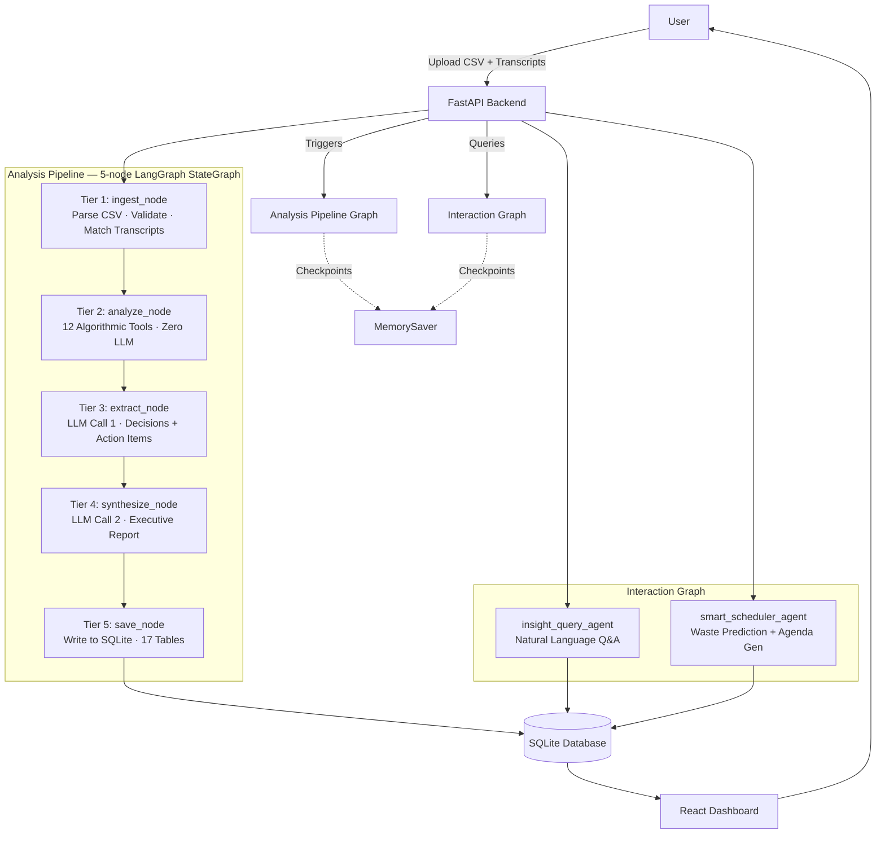

# Meetrix — Actual Implementation Architecture

> This document describes the architecture **as built** — a simplified 5-node pipeline.
> The original planning blueprint is in `implementation.md`.

---

## Architecture Overview

The original plan specified a 19-agent, 6-tier graph with parallel fan-out via `Send()`.
The final implementation simplifies this to a clean linear **5-node LangGraph StateGraph**
with only **2 LLM calls** in the entire analysis pipeline.

All algorithmic analysis (classification, costs, participation, recurrence, waste scores,
health scores, cascade detection, network graph, focus time, recommendations, ROI)
was consolidated into a single `analyze_node` using pure Python tool functions.
This makes the pipeline fast, deterministic, and fully auditable.

---

## Architecture Diagram



---

## Node Inventory

| Tier | Node | Type | Responsibility |
|------|------|------|----------------|
| 1 | `ingest_node` | Function | Parse historical CSV, validate all fields, match uploaded transcript files to meetings by index, parse optional upcoming CSV |
| 2 | `analyze_node` | Function | Run all 12 algorithmic tools: classify meetings, compute costs, participation, recurrence, waste scores, health scores, cascade detection, network graph, focus time, recommendations, interventions, ROI |
| 3 | `extract_node` | **LLM** | Extract real decisions and action items from transcript/notes text using `with_structured_output()`; recompute waste scores with actual decision data |
| 4 | `synthesize_node` | **LLM** | Generate full executive report from a compact analysis summary using `with_structured_output()` |
| 5 | `save_node` | Function | Write all results to SQLite across 17 tables; mark session complete |

**Interaction Graph nodes** (invoked on demand):

| Node | Type | Responsibility |
|------|------|----------------|
| `insight_query_agent` | **LLM** | Answer natural language questions by retrieving meeting data from SQLite and generating a grounded response |
| `smart_scheduler_agent` | **LLM** | Predict waste probability for proposed meetings and generate agendas |

---

## Key Design Decisions

**Why 5 nodes instead of 19 agents?**
The parallel fan-out in the original plan assumed each analysis dimension (cost, participation, recurrence, etc.) would need independent LLM calls. In practice, all of these are deterministic algorithms — pure Python functions with no LLM required. Merging them into one `analyze_node` eliminates latency, removes checkpointing overhead, and makes the logic auditable without any loss of capability.

**Why only 2 LLM calls?**
Decision extraction and report generation are the only tasks that genuinely benefit from language understanding. Everything else — waste scoring, cascade detection, network analysis, ROI projection — is computed deterministically from the data. Minimising LLM calls makes the pipeline faster, cheaper (in compute terms), and more reliable on local hardware.

**LLM configuration:**
- Provider: `ChatOllama` from `langchain-ollama`
- Default model: `llama3.2` (configurable per node via `.env`)
- Temperature: `0.0` for extraction nodes, `0.3` for synthesis/query nodes
- All LLM instances created via a single `get_llm()` factory in `app/llm.py`

---

## Waste Score Formula

```
waste_score = (cost_factor         × 0.25)
            + (decision_deficit    × 0.40)
            + (participation_imbal × 0.20)
            + (recurrence_staleness × 0.15)
```

Decision deficit is keyword-driven with stacking reductions. Each occurrence of
"decided", "approved", "agreed", or "action:" in notes/transcripts reduces the
deficit by 0.40, capped at 3 stacked reductions (floor: 0.0).

---

## Cascade Detection Logic

A cascade chain is flagged when all three conditions hold:
1. Origin meeting has `decision_deficit > 0.8`
2. A follow-up meeting occurs within 72 hours
3. Attendee overlap between origin and follow-up exceeds 40%

Filtered to skip meetings shorter than 20 minutes or with ≤ 2 attendees.

---

*Made with Bob — IBM BOB Hackathon 2026*
